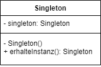

# Software Architektur Guide [DE]

- ⚠️ Der Guide wird laufend ergänzt, erweitert und angepasst. 
- Codebeispiele werden in Pseudocode geschrieben

# Abkürzungen

Diese Abkürzungen werden hier genutzt. 

- Software Architektur -> SA
- Software engineering -> SE
- Test driven development -> TDD
- Domain driven design -> DDD

# Inhalte 

- [Definition](#definition)
- [Begriffe](#begriffe)
- [Kommunikation](#kommunikation)
  - [Angepasste Sprache](#angepasste-sprache)
  - [Explizit vs Implizit](#explizit-vs-implizit)
- [Aufgaben eines Software Architekten](#aufgaben-eines-software-architekten)
- [Stakeholderanalyse](#stakeholderanalyse)
- [Risikoanalyse](#risikoanalyse)
- [Software Architektur entwerfen](#software-architektur-entwerfen)
  - [Ansätze](#anstze)
    - [Top-down Ansatz](#top-down-ansatz)
    - [Bottom-up Ansatz](#bottom-up-ansatz)
    - [Ansichtbasierte Architektur](#ansichtbasierte-architektur)
  - [Black box](#black-box)
  - [White box](#white-box)
- [Software Architektur Muster](#software-architektur-muster)
  - [Schichten](#schichten)
  - [Microservice-Architektur](#microservice-architektur)
  - [Event-Driven-Architektur](#event-driven-architektur)
  - [Pipeline-Architektur](#pipeline-architektur)
- [Software Qualität](#software-qualitt)
- [Software Architektur bewerten](#software-architektur-bewerten)
- [Entwurfsmuster](#entwurfsmuster)
  - [Erzeugungsmuster](#erzeugungsmuster)
    - [Fabrik](#fabrik)
    - [Singleton](#singleton)
    - [Erbauer](#erbauer)
    - [Prototyp](#prototyp)
  - [Strukturmuster](#strukturmuster)
    - [Adapter](#adapter)
    - [Bridge](#bridge)
    - [Kompositum](#kompositum)
    - [Dekorierer](#dekorierer)
    - [Fassade](#fassade)
  - [Proxy](#proxy)
    - [Fliegengewicht](#fliegengewicht)
  - [Verhaltensmuster](#verhaltensmuster)
    - [Beobachter](#beobachter)
    - [Iterator](#iterator)
    - [Zustand](#zustand)
    - [Vermittler](#vermittler)
    - [Template method](#template-method)
- [SOLID](#solid)
  - [Single-responsiblity Principle](#single-responsiblity-principle)
  - [Open-closed Principle](#open-closed-principle)
  - [Liskov Substitution Principle](#liskov-substitution-principle)
  - [Interface Segregation Principle](#interface-segregation-principle)
  - [Dependency Inversion Principle](#dependency-inversion-principle)
- [Designprinzipien](#designprinzipien)
  - [Dependency injection](#dependency-injection)
  - [Schnittstelle vs Implementierung](#schnittstelle-vs-implementierung)
- [Clean coding](#clean-coding)
- [Ressourcen](#ressourcen)
- [Literatur](#literatur)


---


# Definition

Für SA gibt es keine einheitliche Definition. 
An dieser Stelle sollen mehrere Autoren/Organisationen zitiert werden. 

"Architecture is about the important stuff. Whatever that is." - Ralph Johnson

"The goal of software architecture is to minimize the human resources required to build and maintain the required system" - Robert C. Martin

"Fundamental concepts or properties of a system in its environment embodied in its elements, relationships, and in the principles of its design and evolution." - ISO/IEC/IEEE 42010 


# Begriffe

Baustein - Einheit eines Systems (Funktion, Klasse, Modul, Komponente, Konfiguration, usw.)

System - Zusammenschluss von Bausteinen, die einem bestimmten Zweck dienen

Artefakt - Ein erstelltes "Stück" Produkt (Test, Code, Diagramm, Anforderung, usw.)

Kopplung - Grad der Abhängigkeit zwischen zwei Bausteinen. Arten von Abhängikeiten (Zeitlich / Daten / Struktur / Hardware). 
Benötigt ein Klasse viele weitere Objekte zur Erstellung und greift auf Datentypen, die auch von anderen Klassen genutzt werden, so weißt dies eine hohe Kopplung auf. 

Kohäsion - Grad des Zusammenhalts einer Einheit im Sinne, dass eine Einheit für einen bestimmen Anwendungsbereich verantwortlich ist und so auch zusammengefasst werden sollte.
Beispiel: Klasse "Reifen" ist nur für die Erstellung eines Reifens zuständig und nicht für das fahren eines Autos. Dies geschieht in der Klasse Auto. Somit ist eine hohe Kohäsion gegeben.


# Kommunikation


## Angepasste Sprache

Je nach Art des Stakeholder sollte die Sprache entsprechend ausfallen. 
z.B. sollte man mit einem Business analysten eher auf der fachlichen Ebene sprechen und technische Details vermeiden. 


## Explizit vs Implizit

Es sollte vermieden werden implizite Annahmen zu machen. 
Das kann schnell zu unterschiedlichen Interpretationen führen. 
Explizit ansprechen und dokumentieren als impliziert annehmen. 


# Aufgaben eines Software Architekten

- Anforderungen analysieren, klären und gegebenfalls verfeinern 
- Architekturentscheidungen treffen
- Kontinuierliche Analyse der Architekur
- Wissen im Geschäftsfeld aufbauen
- Aktuelle Trends erfassen 
- Designentscheidungen kommunizieren & dokumentieren & Feedback einholen 


# Stakeholderanalyse


# Risikoanalyse


# Software Architektur entwerfen


## Ansätze

- SA sollte wenn möglich iterativ entwickelt werden
- Frühes Feedback einholen


### Top-down Ansatz

Ein System/Komponente/Subsystem wird von "oben" nach "unten" aufgebaut.


### Bottom-up Ansatz

Ein System/Komponente/Subsystem wird von "unten" (detail level) nach "oben" aufgebaut.


### Ansichtbasierte Architektur

- Komponenten Ansicht
- Laufzeit Ansicht
- Hardware Ansicht
- Kontext Ansicht


## Black box

- eine "Black box" versteckt sein inneres. 
- Inneres: Abhängigkeiten / Prozesse / Datenstruktur / Daten
- Fokus auf das Verhalten nach Außen 
- Aufgaben des Bausteins nach Außen
- angebotene Schnittstellen 
- benötigte Schnittsellen 


## White box 

- eine "White box" zeigt sein inneres 
- Inneres: Innere Struktur / Abhängikeiten / Datenstruktur 


# Software Architektur Muster


## Schichten 

- Abstraktionschichten: höhere Schichten greifen auf untere Schichten via Schnittstelle zu
- Schichten um Funktionalität und Verantwortungsbereiche zu trennen


## Microservice-Architektur


## Event-Driven-Architektur


## Pipeline-Architektur


# Software Qualität

Nach ISO 25010:

- Angemessenheit (Functional Suitability)
- Sicherheit (Security)
- Benutzbarkeit (Usability)
- Wartbarkeit (Maintainability)
- Portierbarkeit ()
- Kompatibilität ()
- Leistungsfähigkeit ()
- Wiederverwendbarkeit (Reusability)

> Bei Qualitätseigenschaften können schnell Interessenskonflikte enstehen. So kann die erhöhte Sicherheit für ein schlechtere Performance sorgen. Häufig ist nach Priorität abzuwägen.

# Software Architektur bewerten

Im Rahmen der SA lassen sich zwei Dinge bewerten:
- Prozesse
- Artefakte (Code, Anforderungen, Dokumente)

Dazu gibt es auch die 

- qualitativer Bewertung 
- quantitative Bewertung 


# Entwurfsmuster


## Erzeugungsmuster 


### Fabrik

<details>
  <summary>Fabrik</summary>
  
Problem: Die Bestimmung der Erzeugung einer konkreten Klasse (Produkt) soll zur Laufzeit erfolgen und Implementierung und Erzeugung sollen größtenteils entkoppelt sein. 

Lösung: Die Erzeugung findet durch eine bestimmte (Fabrik-)Methode einer Klasse statt. Die Erzeugung des Produktes wird in einer Oberklasse definiert. Die Erzeugung eines konkreten Produktes wird in einer abgeleiteten Klasse durchgeführt. 


  
</details>


### Singleton

<details>
  <summary>Singleton</summary>

Problem: Von einer Klasse soll es nur eine Instanz geben

Lösung: Klasse mit privatem Konstruktur, damit keine neuen Instanzen erstellt werden können. Klasse hat eine öffentliche Methode, die immer die selbe Instanz zurückgibt. 


</details>


### Erbauer

<details>
  <summary>Erbauer</summary>


Problem: Komplexe Objekte (mehrere Schritte, Verschachtelte Objekte, Viele Felder) sollen erstellt werden. 
  
Lösung: Die Erstellung eines Objektes erfolgt in einer eigenen Klasse.
  

  
</details>


### Prototyp

<details>
  <summary>Prototyp</summary>
  
Problem: Aus einem bestehenden Objekt sollen ein oder mehrere Klone erstellt werden. Zudem ist das Klonen nicht immer so einfach, wenn das Objekt private Attribute aufweise. 
  
Lösung: Es wird eine Prototypschnittstele implementiert mit (meist) einer Methode clone(), die einen Prototyp zurückgibt. Klassen und deren Objekte müssen diese Schnittstelle implementieren und somit auch die Methode clone(). Das bedeutet, dass man der Klasse die Aufgabe des Klonens übergibt. Diese kann dann auf alle privaten Attribute der eigenen Klasse zugreifen. 
  

  
</details>


## Strukturmuster


### Adapter

<details>
  
  <summary>Adapter</summary>
  
Problem: 
Ein bestehender Client will über eine bestehende eigene Schnittstelle auf eine Klasse/Objekt zugreifen.

Lösung:
Ein Adapter, der die Target Schnittstelle implementiert und die externe Klasse oder Objekt integriert. Auf diesen Adapter kann der Client nun zugreifen.


Beispiel:
Der Client kann über die Schnittstelle "Target" auf den "Adapter" zugreifen. Der Adapter sorgt dann für einen Aufruf der Methode von der Klasse "AdaptierteKlasse".
</details>


### Bridge 

<details>
  <summary>Bridge</summary>
  
Problem: 
Durch diverse Vererbungen, welche Abstraktion und Implementierung beinhalten, entsteht eine unübersichtliche und schwer erweiterbare Klassenherachie. 

Lösung: 
- Trennung von Abstraktion und Implementierung. 
- Es gibt eine Abstraktionsklasse, von der spezifische Abstraktionen entstehen können. z.B. Dokument -> Rechnung / Angebot
- Es eine Implementierungklasse/Schnittstelle, von der spezifische Implementierungen entstehen können. -> Drucker -> HTMLDrucker / TextDrucker 
- Es können mehrere Implementierung assoziert werden so Könnter der Abstraktion: Form -> Kugel; die Implementierung können zb Farbe -> Rot/Schwarz und/oder Größe -> klein/groß 


</details>


### Kompositum

<details>
  <summary>Kompositum</summary>
  
Problem: Diverse zusammenhängende und einzelne Objekte sollen auf die gleiche Art und Weise behandelt werden 

Lösung: Implementierung einer Baumstruktur bestehend aus einer Komponente (Interface oder Abstrakte Klasse), einem Blatt (Einzelobjekt) und einem Kompositum (Zusammenhängendes Objekt).


  
</details>


### Dekorierer

<details>

  <summary>Dekorierer</summary>

Problem: Eine Erweiteurng einer (abstrakten) Basisklasse würde zu sehr vielen Klassen führen. 

Lösung: Eine konkrette Komponente wird um Varianten "dekoriert". 


  
</details>

 
### Fassade

<details>
  <summary>Fassade</summary>
  
Problem: Clients müssen auf komplexe und unübersichtliche Systeme zugreifen

Lösung: Vereinigung/Bündelung mehrere Systeme/Komponente/.. in einer Fassade. Clients greifen nur auf diese Fassade zu und können diese als vereinfachte Schnittstelle nutzen. 
Die Systeme dahinter sind verborgen. 


</details>


## Proxy

<details>
  <summary>Proxy</summary>
  
Problem: Auf ein Objekt / Klasse soll nicht direkt zugegriffen werden.
  
Lösung: Es wird ein Stellvertreter (Proxy) vor das Zielobjekt gestellt. Beide imlementieren die selbe Schnittstelle. Der Proxy greift dann auf das Zielobjekt zu.  
  

</details>


### Fliegengewicht

<details>
   <summary>Fliegengewicht (en: Flyweight)</summary>
Problem: Viele Objekte im System verbrauchen viele Ressourcen. 

Lösung: Herauslösen von wiederverwendbaren Objekten. 
  


</details>


## Verhaltensmuster 


### Beobachter

<details>
  
  <summary>Beobachter</summary>
  
Problem: Objekte in einem System wollen über bestimmte Events informiert werden. 

Lösung: Implementierung eines Publisher-Subscriber Patterns. Der Subscriber kann sich beim Publisher "anmelden" um auf Events zu "hören". Der Publisher sammelt diese. Sobald ein Event veröffentlicht wird, werden alle Subscriber informiert. 


  
</details>


### Iterator


### Zustand

<details>
  <summary>Zustand</summary>
  
Problem: Der Zustand wird direkt in den Klassen und Objekten behandelt. Das sorgt für viele if-else Konditionen in den Klassen. 
  
Lösung: Für Zustände werden Klasse implementiert, die diese Zustände halten. 
  

 
</details>


### Vermittler

<details>
  <summary>Vermittler (en: Mediator)</summary>
  
Problem: Viele Klassen agieren zusammen (z.B UI Elemente eines Formulars) und sind somit eng gekoppelt, da diese all untereinander abhängen.
  
Lösung: Förderung der losen Kopplung, in dem eine Zentrale Klasse als Vermittler dient. Somit liegt die gesamte Komplexität in dieser Vermittlerklasse. 
  

  
</details>


### Template method
<details>
  <summary>Template method</summary>
  
Problem: Mehrere Klassen weisen viele gleiche Muster (bzw. Code). 
  
Lösung: Eine abstrakte Klasse hält eine templateMethod und die Methoden der einzelnen Schritte. In der Methode templateMethod werden die Schritte koordiniert. Die konkreten Klasse, die von der abstrakten Klasse erben, können dann einzelne Schritte überschreiben, wenn diese benötigt werden. 
  

</details>


# SOLID

## Single-responsiblity Principle

## Open-closed Principle

## Liskov Substitution Principle

## Interface Segregation Principle

## Dependency Inversion Principle

- Höhere Module / Klassen sollten nicht von Niedrigeren Modulen / Klassen abhängen
- Klassen/Modulen sollten über Schnittstellen abstrahiert werden
- Schnittstellen sollten nicht von Details abhängen
- Details sollten von Schnittstellen abhängen

# Designprinzipien


## Dependency injection
- Abhängigkeiten einer Klasse oder eines Modules sollten nicht innerhalb konstruiert werden 
- Abhängikeiten sollten übergeben werden 

```
// Abhängigkeit wird in der Klasse erzeugt 
// dies sollte vermieden werden 
klasse MeineKlasse {
  new Abhängigkeit()
}

// Abhängigkit wird an Klasse übergeben
klasse MeineKlasse(Abhängigkeit meineAbhängigkeit) {
  this.abhängigkeit = meineAbhängigkeit
}
```


## Schnittstelle vs Implementierung

Entwickle gegen eine Schnittstelle, nicht gegen eine Implementierung.
Denn Implementierungen können sich schnell ändern. Wenn man gegen eine Schnittstelle entwickelt, so kann sich die Implemetierung unabhängig davon ändern. 

> Schnittstelle ist nicht unbedingt ein Interface


# Clean coding


# Ressourcen

- https://refactoring.guru/ 
- https://www.udacity.com/course/software-architecture-design--ud821


# Literatur 

- Fundamentals of Software Architecture (Mark Richards & Neal Ford)
- Entwurfsmuster (Matthias Geirhos)
- Clean Architecture (Robert C. Martin)
- The Clean Coder (Robert C. Martin)
- Einführung in die Softwaretechnik (Manfred Broy & Marco Kuhrmann)


