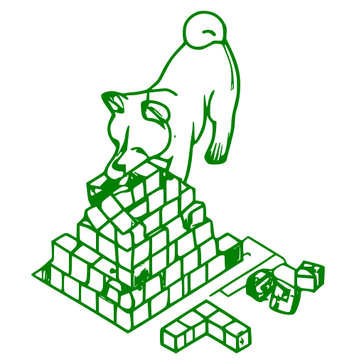

<h1 align="center">Software Architecture Guide</h1>

---

# Abbreviations

- **Software Architecture** → SA  
- **Software Engineering** → SE  
- **Test-Driven Development** → TDD  
- **Domain-Driven Design** → DDD  

# Content

- [Definitions](#definitions)  
- [Terms](#terms)  
- [Communication](#communication)  
  - [Adjusted Language](#adjusted-language)  
  - [Explicit vs. Implicit](#explicit-vs-implicit)  
- [Tasks of a Software Architect](#tasks-of-a-software-architect)  
- [Stakeholder Analysis](#stakeholder-analysis)  
- [Risk Analysis](#risk-analysis)  
- [Design Software Architecture](#design-software-architecture)  
  - [Approaches](#approaches)  
    - [Top-Down Approach](#top-down-approach)  
    - [Bottom-Up Approach](#bottom-up-approach)  
    - [View-Based Architecture](#view-based-architecture)  
  - [Black Box](#black-box)  
  - [White Box](#white-box)  
- [Software Architecture Patterns](#software-architecture-patterns)  
  - [Layers](#layers)  
  - [Microservice Architecture](#microservice-architecture)  
  - [Event-Driven Architecture](#event-driven-architecture)  
  - [Pipeline Architecture](#pipeline-architecture)  
  - [Service-Oriented Architecture](#service-oriented-architecture)  
- [Software Quality](#software-quality)  
- [Evaluate Software Architecture](#evaluate-software-architecture)  
- [Relations](#relations)  
- [Design Patterns](#design-patterns)  
  - [Creational Patterns](#creational-patterns)  
    - [Factory Method](#factory-method)  
    - [Singleton](#singleton)  
    - [Builder](#builder)  
    - [Prototype](#prototype)  
  - [Structural Patterns](#structural-patterns)  
    - [Adapter](#adapter)  
    - [Bridge](#bridge)  
    - [Composite](#composite)  
    - [Decorator](#decorator)  
    - [Facade](#facade)  
    - [Proxy](#proxy)  
    - [Flyweight](#flyweight)  
  - [Behavioral Patterns](#behavioral-patterns)  
    - [Observer](#observer)  
    - [Iterator](#iterator)  
    - [State](#state)  
    - [Mediator](#mediator)  
    - [Template Method](#template-method)  
    - [Memento](#memento)  
    - [Strategy](#strategy)  
    - [Visitor](#visitor)  
    - [Chain of Responsibility](#chain-of-responsibility)  
- [SOLID](#solid)  
  - [Single-Responsibility Principle](#single-responsibility-principle)  
  - [Open-Closed Principle](#open-closed-principle)  
  - [Liskov Substitution Principle](#liskov-substitution-principle)  
  - [Interface Segregation Principle](#interface-segregation-principle)  
  - [Dependency Inversion Principle](#dependency-inversion-principle)  
- [Design Principles](#design-principles)  
  - [Dependency Injection](#dependency-injection)  
  - [Interface vs. Implementation](#interface-vs-implementation)  
- [Clean Coding](#clean-coding)  
- [Resources](#resources)  
- [Literature](#literature)  

---

# Definitions

There is no single, definitive definition for software architecture. Different authors and organizations provide their interpretations:

- "Architecture is about the important stuff. Whatever that is." – Ralph Johnson  
- "The goal of software architecture is to minimize the human resources required to build and maintain the required system." – Robert C. Martin  
- "Fundamental concepts or properties of a system in its environment embodied in its elements, relationships, and in the principles of its design and evolution." – ISO/IEC/IEEE 42010  

# Terms

- **Building Block**: A unit of a system, such as a component, module, class, or subsystem.  
- **System**: A collection of building blocks working together to achieve a specific goal.  
- **Artifact**: A "piece" of a product, such as code, documentation, or tests.  
- **Coupling**: The degree of dependency between two building blocks. Types include temporal, data, structural, and hardware coupling.  
  _Example_: A `Car` class heavily using `Engine` and `Tires` classes has high coupling.  
- **Cohesion**: The degree to which elements of a unit belong together.  
  _Example_: Methods related to a `Car` should all be part of the `Car` class.  

# Communication

## Adjusted Language

The language used by a software architect should adapt to the audience's technical knowledge, ensuring effective communication with stakeholders.

## Explicit vs. Implicit

All assumptions and decisions must be explicitly communicated and documented. Avoid implicit assumptions like, "It was clear to me," which lead to misunderstandings.

# Tasks of a Software Architect

- Analyze, clarify, and refine requirements  
- Make architectural decisions  
- Continuously evaluate architecture  
- Build knowledge in the domain area  
- Stay updated on current trends  
- Communicate and document design decisions, gathering feedback  

# Stakeholder Analysis

Stakeholder analysis involves identifying the people relevant to the project. Stakeholders vary by organization and project, including development managers, budget managers, other departments, or customers. After identifying stakeholders, they are prioritized by their level of involvement and information needs.

# Risk Analysis

Risk analysis includes:

- Identifying risks  
- Reducing the consequences of risks  
- Reducing the probability of risks occurring  
- Monitoring risks  

### Types of Risks

- **Known Risks**: Risks already identified and likely to occur.  
- **Known Risks from Other Projects**: Risks known from experience but not yet relevant to the project.  
- **Unknown Risks**: Risks not yet identified.

### Steps in Risk Management

1. Risk Identification  
2. Risk Analysis  
   - Qualitative Risk Analysis  
   - Quantitative Risk Analysis  
3. Risk Planning  
4. Risk Monitoring  

# Design Software Architecture

## Approaches

- Iterative development is recommended.  
- Gather early feedback.  

### Top-Down Approach

Design begins with high-level components and progresses to detailed levels.

### Bottom-Up Approach

Design begins with detailed components and integrates them into higher levels.

### View-Based Architecture

Focuses on:

- **Component View**
- **Runtime View**
- **Hardware View**
- **Context View**

## Black Box

A "black box" hides its internal structure and focuses on:

- External behavior  
- Provided and required interfaces  

## White Box

A "white box" reveals its internal structure, including:

- Inner components  
- Dependencies  

# Software Architecture Patterns

## Layers

- Higher layers access lower layers through interfaces.  
- Layers separate functionality and responsibilities.  
- Only downward calls are allowed (top-down).

## Microservice Architecture

Microservice architecture describes systems composed of small, independent, and loosely coupled services. Each service is maintainable, testable, and deployable independently.

## Event-Driven Architecture

Event-driven architecture centers on events triggering specific actions. This enables loose coupling and flexibility between components.

## Pipeline Architecture

Pipeline architecture is suited for sequential tasks. Each stage in the pipeline performs a task and passes data to the next stage.

## Service-Oriented Architecture

- The system consists of one or more services.  
- Services often communicate over HTTP (e.g., REST).  
- Typically, there is a shared database instance.  
- Each service has a dedicated function.  

# Software Quality

Software quality lacks a universal definition. ISO standards define quality attributes, such as maintainability. Prioritizing quality attributes often involves trade-offs—e.g., security may reduce performance.

# Evaluate Software Architecture

Evaluation focuses on:

- **Processes**  
- **Artifacts** (e.g., code, requirements, documentation)  

Evaluation methods include:

- **Qualitative Assessment**  
- **Quantitative Evaluation**  

# Relations

**Inheritance**: A subclass inherits from a superclass (e.g., `Employee` inherits from `Human`).

**Association**: Two classes interact without strong dependencies (e.g., `Employee` uses `Car`).

**Aggregation**: A class is composed of other classes, which can exist independently (e.g., `BusDriver` includes `Bus` and `Driver`).

**Composition**: A class is composed of parts that cannot exist independently (e.g., `Human` with `Hand` and `Leg`).

# Design Patterns

Design principles are helpful solutions for common software development problems. They can, however, increase complexity if applied unnecessarily. Patterns should be adapted to specific contexts where needed.

## Creational Patterns

### Factory Method

**Problem**: You need to create classes dynamically at runtime, especially when the required class is not known in advance.  
**Solution**: Implement a method that creates instances of classes dynamically.

### Singleton

**Problem**: Only one instance of a specific class should exist.  
**Solution**: Make the constructor private and provide a static method (`getInstance()`) to return the single instance. This ensures only one instance exists.

### Builder

**Problem**: Complex objects requiring multiple steps or nested configurations need to be created.  
**Solution**: Use a builder class to construct the object step-by-step.

### Prototype

**Problem**: You need to create clones of specific objects.  
**Solution**: Implement a `clone` method in the class to create and return a copy of the object.

## Structural Patterns

### Adapter

**Problem**: Two classes need to work together but have incompatible interfaces.  
**Solution**: Use an adapter class to bridge the compatibility gap.

### Bridge

**Problem**: A complex inheritance structure makes the system difficult to extend.  
**Solution**: Separate abstraction and implementation into independent hierarchies.

### Composite

**Problem**: Treat individual objects and compositions of objects uniformly.  
**Solution**: Use a tree structure with components, leaves (individual objects), and composites (collections).

### Decorator

**Problem**: Extending functionality through inheritance creates excessive subclasses.  
**Solution**: Use decorator classes to dynamically add behavior to components.

### Facade

**Problem**: Clients interact with a complex subsystem.  
**Solution**: Provide a simplified interface (facade) to the subsystem.

### Proxy

**Problem**: Access to an object needs to be controlled.  
**Solution**: Use a proxy class to manage access to the real object.

### Flyweight

**Problem**: Many similar objects consume excessive resources.  
**Solution**: Share common objects to reduce memory usage.

## Behavioral Patterns

### Observer

**Problem**: Objects need to be notified about changes in another object.  
**Solution**: Use a publisher-subscriber pattern to notify observers about changes.

### Iterator

**Problem**: You need to traverse a complex object structure.  
**Solution**: Implement an iterator to sequentially access elements of the structure.

### State

**Problem**: State management within objects results in numerous conditional statements.  
**Solution**: Implement state classes to encapsulate specific states.

### Mediator

**Problem**: Multiple objects are tightly coupled and depend on each other.  
**Solution**: Use a mediator class to manage communication between objects.

### Template Method

**Problem**: Common behavior is duplicated across subclasses.  
**Solution**: Define the behavior in a base class and allow subclasses to override specific steps.

### Memento

**Problem**: You need to save and restore an object's state.  
**Solution**: Use a memento class to capture and restore the object's state.

### Strategy

**Problem**: A class needs to support multiple algorithms or behaviors.  
**Solution**: Define strategies as separate classes and let the class use them interchangeably.

### Visitor

**Problem**: Adding new operations to a class hierarchy violates the Single Responsibility Principle.  
**Solution**: Implement operations as separate visitor classes that operate on the class hierarchy.

### Chain of Responsibility

**Problem**: An object needs to pass through a sequence of handlers.  
**Solution**: Implement a chain of handlers where each one processes the object or passes it to the next.

# SOLID

## Single-Responsibility Principle

A class should have only one reason to change, meaning it should encapsulate only one responsibility.

## Open-Closed Principle

"Modules should be both open for extension and closed for modification." – Bertrand Meyer

## Liskov Substitution Principle

Objects of a superclass should be replaceable with objects of a subclass without affecting the correctness of the program.

## Interface Segregation Principle

No client should be forced to depend on methods it does not use.

## Dependency Inversion Principle

High-level modules should not depend on low-level modules; both should depend on abstractions.

# Clean Coding

Clean code is easy to read, understand, and maintain. Follow best practices to ensure code quality and minimize technical debt.

# Resources

- [Refactoring Guru](https://refactoring.guru/)  
- [Udacity: Software Architecture & Design](https://www.udacity.com/course/software-architecture-design--ud821)

# Literature

**English:**
- *Fundamentals of Software Architecture* by Mark Richards & Neal Ford  
- *Clean Architecture* by Robert C. Martin  
- *The Clean Coder* by Robert C. Martin  

**German:**
- *Entwurfsmuster* by Matthias Geirhos  
- *Einführung in die Softwaretechnik* by Manfred Broy & Marco Kuhrmann

