# Software Architecture Guide

> The code examples are written in pseudocode.

# Abbreviations

- Software Architektur -> SA
- Software engineering -> SE
- Test driven development -> TDD
- Domain driven design -> DDD

# Content

- [Definitions](#definitions)
- [Terms](#terms)
- [Communication](#communication)
  - [Adjusted Language](#adjusted-language)
  - [Explicit vs Implicit](#explicit-vs-implicit)
- [Tasks of a Software Architect](#tasks-of-a-software-architect)
- [Stakeholder analysis](#stakeholder-analysis)
- [Risk analysis](#risk-analysis)
- [Design software architecture](#design-software-architecture)
  - [Ansätze](#ansätze)
    - [Top-down Ansatz](#top-down-ansatz)
    - [Bottom-up Ansatz](#bottom-up-ansatz)
    - [Ansichtbasierte Architektur](#ansichtbasierte-architektur)
  - [Black box](#black-box)
  - [White box](#white-box)
- [Software Architecture Pattern](#software-architecture-pattern)
  - [Layers](#layers)
  - [Microservice-Architektur](#microservice-architektur)
  - [Event-Driven-Architektur](#event-driven-architektur)
  - [Pipeline-Architektur](#pipeline-architektur)
- [Software Qualität](#software-qualität)
- [Software Architektur bewerten](#software-architektur-bewerten)
- [Relations](#relations)
- [Design patterns](#design-patterns)
  - [Creational patterns](#creational-patterns)
    - [Factory method](#factory-method)
    - [Singleton](#singleton)
    - [Builder](#builder)
    - [Prototype](#prototype)
  - [Structural patterns](#structural-patterns)
    - [Adapter](#adapter)
    - [Bridge](#bridge)
    - [Composite](#composite)
    - [Decorator](#decorator)
    - [Fassade](#fassade)
    - [Proxy](#proxy)
    - [Flyweight](#flyweight)
  - [Behavioral patterns](#behavioral-patterns)
    - [Beobachter](#beobachter)
    - [Iterator](#iterator)
    - [State](#state)
    - [Mediator](#mediator)
    - [Template method](#template-method)
    - [Memento](#memento)
    - [Strategy](#strategy)
    - [Visitor](#visitor)
    - [Chain of Responsibility](#chain-of-responsibility)
- [SOLID](#solid)
  - [Single-responsiblity Principle](#single-responsiblity-principle)
  - [Open-closed Principle](#open-closed-principle)
  - [Liskov Substitution Principle](#liskov-substitution-principle)
  - [Interface Segregation Principle](#interface-segregation-principle)
  - [Dependency Inversion Principle](#dependency-inversion-principle)
- [Designprinzipien](#designprinzipien)
  - [Dependency injection](#dependency-injection)
  - [Schnittstelle vs Implementierung](#schnittstelle-vs-implementierung)
- [Clean coding](#clean-coding)
- [Ressourcen](#ressourcen)
- [Literature](#literature)


---


# Definitions

There is not one final definition for software archtecture. 
Several authors/organizations will be cited at this point. 

"Architecture is about the important stuff. Whatever that is." - Ralph Johnson

"The goal of software architecture is to minimize the human resources required to build and maintain the required system" - Robert C. Martin

"Fundamental concepts or properties of a system in its environment embodied in its elements, relationships, and in the principles of its design and evolution." - ISO/IEC/IEEE 42010 


# Terms

**Building block**: A building block is a unit of a system. A building block could be a component, module, class, configuration, system, or subsystem.

**System**: A system is an association of building blocks. A system has a specific goal. 

**Artifact**: An artifact is a "piece" of a product. It can be tests, code, documentation, or anything similar. 

**Coupling**: Degree of dependency between two building blocks. Types of dependencies are temporal, data, structure, or hardware.
Example: Imagine A class car that uses many different classes in its methods like an Engine class or Tires class has a high coupling. 

**Cohesion**: Degree of cohesion of a unit in a system. Functionality, values, and properties with the same scope should belong together. 
Example: Imagine two methods for a Car.


# Communication

## Adjusted Language

The way an architect talks to stakeholders should be different.
It should depend on the stakeholders and their technical knowledge. 


## Explicit vs Implicit

Assumptions and decisions should always be explicitly communicated and documented.
Implicit assumptions such as "It was clear to me" lead to misunderstandings and problems. 


# Tasks of a Software Architect

- Analyze, clarify and, if necessary, refine requirements 
- Make architectural decisions
- Continuously analyze architecture
- Build knowledge in the business area
- Capture current trends 
- Communicate & document design decisions & gather feedback 


# Stakeholder analysis

The stakeholder analysis is about identifying the people relevant to the project. These stakeholders can vary significantly from one organization to another and from one project to another, be it the development manager, the budget manager, another department, or, in the case of a service company, the customer. Each of these stakeholders contributes to the success of the project. Once the stakeholders have been identified, they are prioritized, i.e., do they only need to be informed, or are they active participants in the project.


# Risk analysis

The risk analysis includes the following steps:

- Identify the risk
- Reducing the consequences of a risk
- Reducing the probability of a risk occurring
- Risk monitoring

It is essential to consider the different types of risks:

- Known risks: risks that are already known and can/will occur.
- Known risks from other projects: This means chances known from experience, but it is still unknown whether they have any relevance for the project.
- Unknown risks

Within the software architecture, we can consider the following processes:

- Risk Identification
- Risk Analysis
  - Qualitative risk analysis
  - Quantitative Risk Analysis
- Risk planning
- Risk monitoring


# Design software architecture


## Approaches

- Software architecture should be developed iteratively if possible
- Obtain early feedback


### Top-down approach

A system/component/subsystem is designed from "top" to "bottom".


### Bottom-up approach

A system/component/subsystem is designed from the "bottom" (detail level) to the "top".


### View-based architecture

- Components View
- Runtime View
- Hardware View
- Context View


## Black box

- A "black box" hides its interior. 
- Inside: dependencies / processes / data structure / data
- Focus on the external behavior 
- Tasks of the building block to the outside
- Offered interfaces 
- Required interfaces 


## White box 

- a "white box" shows its inner behaviour and attributes 
- Inner: Inner structure / dependencies / data structure 


# Software Architecture Pattern


## Layers

- Abstraction layers: higher layers access lower layers via interface
- Layers to separate functionality and areas of responsibility
- Calls only take place top-down, i.e., only the upper layers access lower layers, not vice versa


## Microservice-Architektur


## Event-Driven-Architektur


## Pipeline-Architektur


# Software Qualität

According to ISO 25010:

- Functional Suitability
- Security
- Usability
- Maintainability
- Portability
- Compatibility
- Performance
- Reusability

> Conflicts of interest can quickly arise in the case of quality properties. For example, increased security can lead to poorer performance. It is often necessary to weigh up priorities.

# Evaluate software architecture

Two things can be evaluated in the context of software architecture:
- Processes
- Artifacts (code, requirements, documents)

For this purpose there is also the 

- qualitative assessment 
- quantitative evaluation 


# Relations

**Inheritance**: This relation exists when a class inherits from another. 
E.g., When Class `Employee` (Subclass) inherits from `Human` (Superclass) . 

**Association**: An arcitect should use Association when there is no dependency between two classes, but those classes can communicate.
E.g., Modeling a company with `Employee` you could add `Car` as an association because the Employee can use it. 

**Aggregation**: An arcitect should use Aggregation if one class consists of several other classes. But these classes can also exist on their own. 
E.g., the class `BusDriver` consists of Class `Bus` and `Driver`. `Bus` and `Driver` can exist on their own. 

**Composition**: An arcitect should use Composition if one class consists of several other classes. But these classes cannot exist on their own. 
E.g., the class `Human` consists of Class `Hand` and `Leg`. Both classes cannot exist on their own.


# Design patterns

Design patterns are helpful solutions for problems in software development. Nevertheless, design patterns can increase complexity without an advantage. It is possible to adjust those patterns if that will fit better to a problem. 


## Creational patterns 


### Fabrik

<details>
  <summary>Fabrik</summary>
  
Problem: Die Bestimmung der Erzeugung einer konkreten Klasse (Produkt) soll zur Laufzeit erfolgen und Implementierung und Erzeugung sollen größtenteils entkoppelt sein. 

Lösung: Die Erzeugung findet durch eine bestimmte (Fabrik-)Methode einer Klasse statt. Die Erzeugung des Produktes wird in einer Oberklasse definiert. Die Erzeugung eines konkreten Produktes wird in einer abgeleiteten Klasse durchgeführt. 

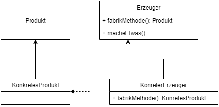
  
</details>


### Singleton

Problem / Requirement: There should be only one instance from a specific class. 

Solution: The constructor of the Singleton-Class should be private, and the instance stored in a private attribute. Additionally, one method (getInstance()) returns that instance. The method returns the instance if an instance is already there and creates one before if there is no instance.


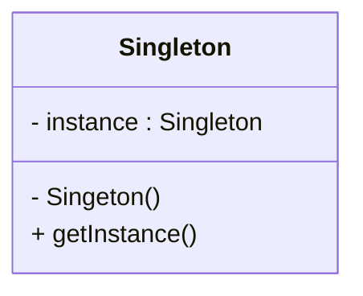

```
class Singleton {
  private static instance: Singleton;
  
  private constructor Singleton();
  
  public getInstance(): Singleton {
     if (this.instance == null) {
       this.instance = new Singleton();
     }
     
     return this.instance;
  }
}
```


### Erbauer

<details>
  <summary>Erbauer</summary>


Problem: Komplexe Objekte (mehrere Schritte, Verschachtelte Objekte, Viele Felder) sollen erstellt werden. 
  
Lösung: Die Erstellung eines Objektes erfolgt in einer eigenen Klasse.
  
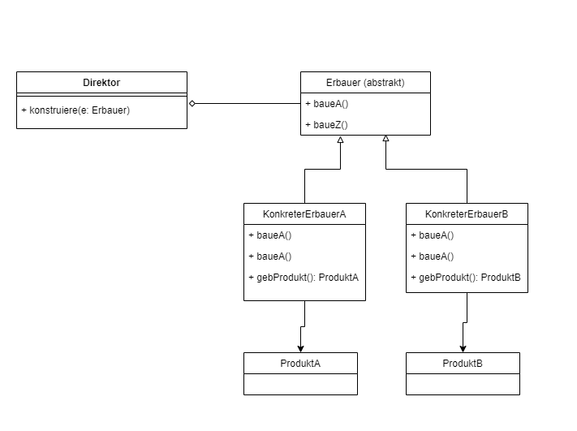
  
</details>


### Prototyp

<details>
  <summary>Prototyp</summary>
  
Problem: Aus einem bestehenden Objekt sollen ein oder mehrere Klone erstellt werden. Zudem ist das Klonen nicht immer so einfach, wenn das Objekt private Attribute aufweise. 
  
Lösung: Es wird eine Prototypschnittstele implementiert mit (meist) einer Methode clone(), die einen Prototyp zurückgibt. Klassen und deren Objekte müssen diese Schnittstelle implementieren und somit auch die Methode clone(). Das bedeutet, dass man der Klasse die Aufgabe des Klonens übergibt. Diese kann dann auf alle privaten Attribute der eigenen Klasse zugreifen. 
  
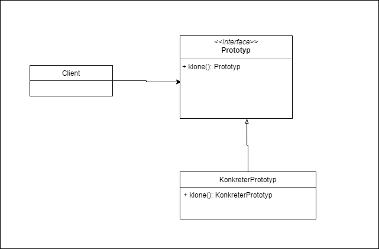
  
</details>


## Structural patterns


### Adapter

<details>
  
  <summary>Adapter</summary>
  
Problem: 
Ein bestehender Client will über eine bestehende eigene Schnittstelle auf eine Klasse/Objekt zugreifen.

Lösung:
Ein Adapter, der die Target Schnittstelle implementiert und die externe Klasse oder Objekt integriert. Auf diesen Adapter kann der Client nun zugreifen.


Beispiel:
Der Client kann über die Schnittstelle "Target" auf den "Adapter" zugreifen. Der Adapter sorgt dann für einen Aufruf der Methode von der Klasse "AdaptierteKlasse".
</details>


### Bridge 

<details>
  <summary>Bridge</summary>
  
Problem: 
Durch diverse Vererbungen, welche Abstraktion und Implementierung beinhalten, entsteht eine unübersichtliche und schwer erweiterbare Klassenherachie. 

Lösung: 
- Trennung von Abstraktion und Implementierung. 
- Es gibt eine Abstraktionsklasse, von der spezifische Abstraktionen entstehen können. z.B. Dokument -> Rechnung / Angebot
- Es eine Implementierungklasse/Schnittstelle, von der spezifische Implementierungen entstehen können. -> Drucker -> HTMLDrucker / TextDrucker 
- Es können mehrere Implementierung assoziert werden so Könnter der Abstraktion: Form -> Kugel; die Implementierung können zb Farbe -> Rot/Schwarz und/oder Größe -> klein/groß 

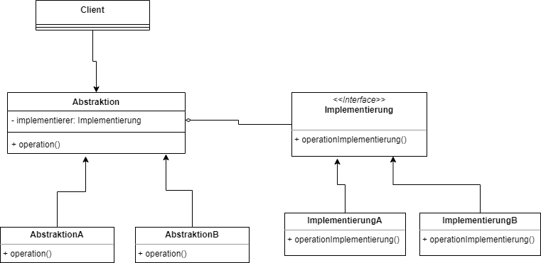
</details>


### Kompositum

<details>
  <summary>Kompositum</summary>
  
Problem: Diverse zusammenhängende und einzelne Objekte sollen auf die gleiche Art und Weise behandelt werden 

Lösung: Implementierung einer Baumstruktur bestehend aus einer Komponente (Interface oder Abstrakte Klasse), einem Blatt (Einzelobjekt) und einem Kompositum (Zusammenhängendes Objekt).

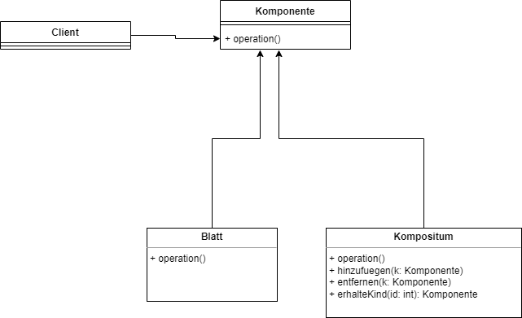
  
</details>


### Dekorierer

<details>

  <summary>Dekorierer</summary>

Problem: Eine Erweiteurng einer (abstrakten) Basisklasse würde zu sehr vielen Klassen führen. 

Lösung: Eine konkrette Komponente wird um Varianten "dekoriert". 

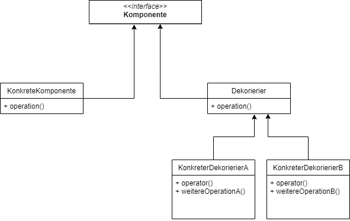
  
</details>

 
### Fassade

<details>
  <summary>Fassade</summary>
  
Problem: Clients müssen auf komplexe und unübersichtliche Systeme zugreifen

Lösung: Vereinigung/Bündelung mehrere Systeme/Komponente/.. in einer Fassade. Clients greifen nur auf diese Fassade zu und können diese als vereinfachte Schnittstelle nutzen. 
Die Systeme dahinter sind verborgen. 

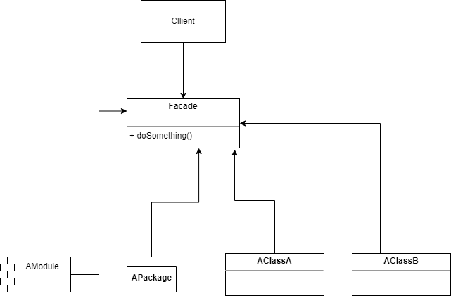
</details>


## Proxy

<details>
  <summary>Proxy</summary>
  
Problem: Auf ein Objekt / Klasse soll nicht direkt zugegriffen werden.
  
Lösung: Es wird ein Stellvertreter (Proxy) vor das Zielobjekt gestellt. Beide imlementieren die selbe Schnittstelle. Der Proxy greift dann auf das Zielobjekt zu.  
  
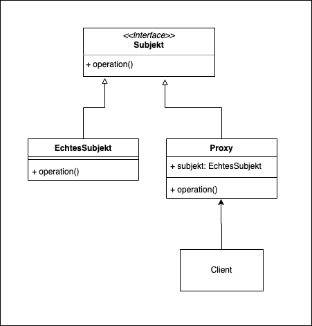
</details>


### Fliegengewicht

<details>
   <summary>Fliegengewicht (en: Flyweight)</summary>
Problem: Viele Objekte im System verbrauchen viele Ressourcen. 

Lösung: Herauslösen von wiederverwendbaren Objekten. 
  
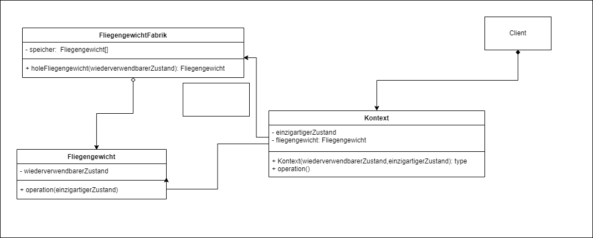

</details>


## Behavioral patterns


### Beobachter

<details>
  
  <summary>Beobachter</summary>
  
Problem: Objekte in einem System wollen über bestimmte Events informiert werden. 

Lösung: Implementierung eines Publisher-Subscriber Patterns. Der Subscriber kann sich beim Publisher "anmelden" um auf Events zu "hören". Der Publisher sammelt diese. Sobald ein Event veröffentlicht wird, werden alle Subscriber informiert. 

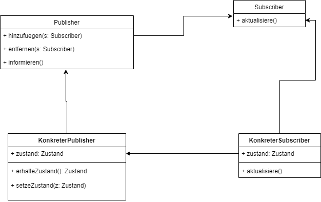
  
</details>


### Iterator

<details>
<summary>Iterator</summary>
  
Problem: Es soll möglich sein, über eine komplexe Gruppe von Objekten zu iterieren. Baumstruktur / Liste 
  
Lösung: Strukturen soll Durchlaufen werden mit einem Iterator, der immer eine Referenz auf das nächste Elemente besitzt. Dabei gibt es den Iterator, der die Methoden bereithält, um das nächste Elemente zu erhalten. Die IteratorKollektion ist für die Erstellung der Kollektion zuständig. 
  
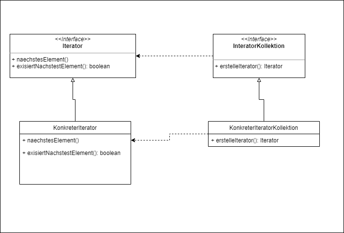
  
</details>

### Zustand

<details>
  <summary>Zustand</summary>
  
Problem: Der Zustand wird direkt in den Klassen und Objekten behandelt. Das sorgt für viele if-else Konditionen in den Klassen. 
  
Lösung: Für Zustände werden Klasse implementiert, die diese Zustände halten. 
  
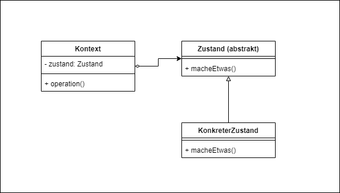
 
</details>


### Vermittler

<details>
  <summary>Vermittler (en: Mediator)</summary>
  
Problem: Viele Klassen agieren zusammen (z.B UI Elemente eines Formulars) und sind somit eng gekoppelt, da diese all untereinander abhängen.
  
Lösung: Förderung der losen Kopplung, in dem eine Zentrale Klasse als Vermittler dient. Somit liegt die gesamte Komplexität in dieser Vermittlerklasse. 
  
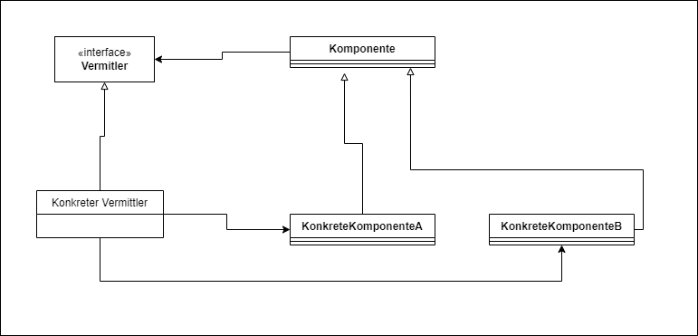
  
</details>


### Template method
<details>
  <summary>Template method</summary>
  
Problem: Mehrere Klassen weisen viele gleiche Muster (bzw. Code). 
  
Lösung: Eine abstrakte Klasse hält eine templateMethod und die Methoden der einzelnen Schritte. In der Methode templateMethod werden die Schritte koordiniert. Die konkreten Klasse, die von der abstrakten Klasse erben, können dann einzelne Schritte überschreiben, wenn diese benötigt werden. 
  
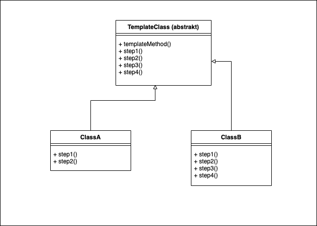
</details>


### Memento

<details>
<summary>Memento</summary>

Problem: Zustände eines Objektes sollen gespeichert werden, damit man auf diese zu einem späteren Zeitpunkt zurückgreifen kann bzw diese wiederherstellen kann. 

Lösung: Einem Uhrheber (belieblige Klasse) wird ein Memento zur Verfügung gestellt. Dieser sorgt dafür, dass der Zustand (private inner Attribute) von Uhrheber gespeichert wird. Objekte des Memento werden dann in einem sog. Aufbewahrer gespeichert. 

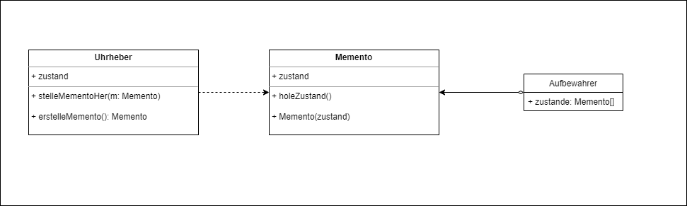
</details>


### Strategie

<details>
<summary>Strategie (en: Strategy)</summary>

Problem: Für einen Kontext (z.B Klasse) soll es mehrere Implementierung/Algorithmen geben 

Lösung: Ein Kontext besitzt ein Attribute welche auf eine Strategie zeigt. In dieser Strategie sind die unterschiedlichen Implementierungen enthalten (Eine Strategy - eine Implementierung). Die Art der Implementierung wird somit nicht von dem Context selber gesteuert, sondern hängt davon ab, welche Strategie der Client zuweist. 
  

</details>


### Besucher
<details>
  
  <summary>Besucher (en: Visitor)</summary>
  
  Problem: Eine Klasse (Element) soll unterschiedliche Methoden (PDF Generierung / XML Generierung) (mit unterschiedlichen Kontexten anwenden). Dies würde zum Verstoß des Single-Responsibility-Prinzip führen. 
  
  Lösung: Trennung der Operation und Klassenherachie. Es wird ein Objekt (Besucher) erstellt, welches für die Operationen verantwortlich ist.  Das Element bekommt enthält eine Methode, welches den Besucher übergeben bekommt und dann die entsprechende Operation durchführt. 
  
  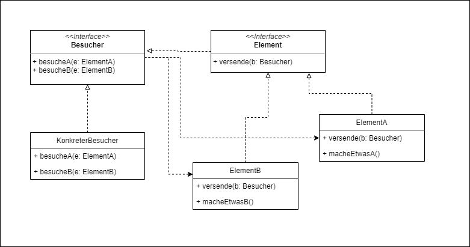
</details>

### Chain of Responsibility

<details>
  
*Problem / Requirement*: An (e.g.) object must go through multiple tasks. These tasks must perform sequentially. 

*Solution*: The object gets sent to a "Chain of Responsibility". This chain is a collection of handlers. The object goes through this chain until a handler answers the request.  
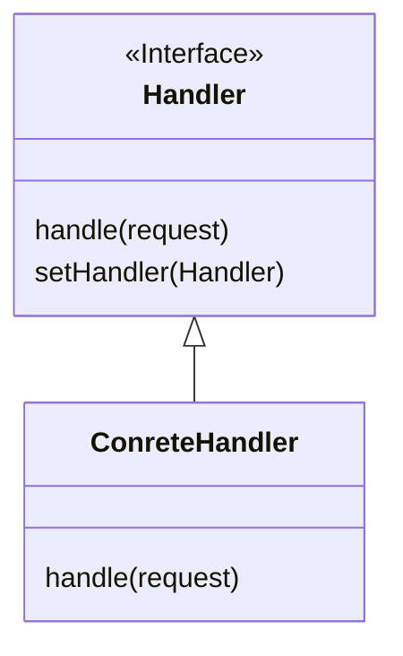
  
</details>


# SOLID

## Single-responsiblity Principle
  
There should be only one reason (actor) to change a class. 
  Single responsibility does not mean that a block should only do one thing. 

## Open-closed Principle
  
“Modules should be both open (for extension) and closed (for modification).” - Bertrand Meyer

The open-closed principle means that changes to a module, which can be a module, classes, and so on, should extend the behavior but not modify it. 

## Liskov Substitution Principle

## Interface Segregation Principle

## Dependency Inversion Principle

- Höhere Module / Klassen sollten nicht von Niedrigeren Modulen / Klassen abhängen
- Klassen/Modulen sollten über Schnittstellen abstrahiert werden
- Schnittstellen sollten nicht von Details abhängen
- Details sollten von Schnittstellen abhängen

# Designprinzipien


## Dependency injection
- Abhängigkeiten einer Klasse oder eines Modules sollten nicht innerhalb konstruiert werden 
- Abhängikeiten sollten übergeben werden 

```
// Abhängigkeit wird in der Klasse erzeugt 
// dies sollte vermieden werden 
klasse MeineKlasse {
  new Abhängigkeit()
}

// Abhängigkit wird an Klasse übergeben
klasse MeineKlasse(Abhängigkeit meineAbhängigkeit) {
  this.abhängigkeit = meineAbhängigkeit
}
```


## Schnittstelle vs Implementierung

Entwickle gegen eine Schnittstelle, nicht gegen eine Implementierung.
Denn Implementierungen können sich schnell ändern. Wenn man gegen eine Schnittstelle entwickelt, so kann sich die Implemetierung unabhängig davon ändern. 

> Schnittstelle ist nicht unbedingt ein Interface


# Clean coding


# Ressourcen

- https://refactoring.guru/ 
- https://www.udacity.com/course/software-architecture-design--ud821


# Literature 

EN:
- Fundamentals of Software Architecture (Mark Richards & Neal Ford)
- Clean Architecture (Robert C. Martin)
- The Clean Coder (Robert C. Martin)

DE:
- Entwurfsmuster (Matthias Geirhos)
- Einführung in die Softwaretechnik (Manfred Broy & Marco Kuhrmann)


