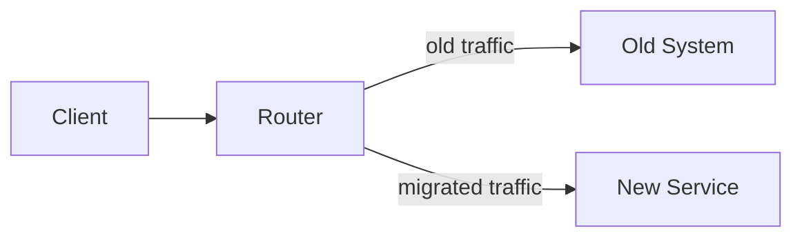

# Breaking a System Apart

## Overview

At some point, a system that started as a single unit needs to be split into smaller, independent parts. This is a gradual process — not a one-time event — and it requires care to avoid breaking things along the way.

The goal is to end up with parts that can be changed, deployed, and scaled on their own. The challenge is getting there without stopping all other work.

## When to start splitting

Signs that splitting makes sense:

- Different parts need to scale to very different sizes
- Multiple teams keep stepping on each other's changes
- One area changes frequently while others stay stable for months
- Deployments are risky because everything ships as one unit

There is no need to split a system that works well as a whole. Splitting adds complexity. Do it only when the cost of keeping everything together is higher than the cost of managing separate parts.

## Finding the right cuts

The first step is identifying natural seams — parts of the system that already have little connection to the rest.

**Signs of a good cut:**
- A part that could be taken offline without affecting the rest
- A part that owns its own data and does not share tables with others
- A part that belongs clearly to one team or one business function

**Signs of a bad cut:**
- Splitting by technical layer (e.g., "database layer" vs "service layer") rather than by business function
- Splitting parts that share the same data or must stay in sync at all times

Wrong cuts are expensive to fix. It is better to spend time finding the right boundary than to move fast and redo it later.

## Strangler Fig

The [strangler fig](../foundations/glossary.md#strangler-fig) pattern lets you replace parts of an existing system piece by piece, without a full rewrite.

1. Add a routing layer in front of the old system
2. Build the new part alongside the old one
3. Redirect traffic to the new part, one piece at a time
4. Once all traffic has moved, remove the old part

The old system gradually loses all its traffic — it is "strangled" — without ever needing a big cutover that affects everything at once.

## Component-based decomposition

Before splitting into separate deployable services, it helps to first draw clean internal boundaries inside the existing system.

Steps:
1. Identify business capabilities — what the system does (e.g. ordering, billing, notifications)
2. Group all code for each capability together: data access, business logic, and API
3. Make sure each group only talks to others through defined interfaces, not through shared internal code
4. Once the internal boundaries are clean, extracting a capability into a separate service becomes straightforward

This reduces risk: you can verify the boundaries work without taking on the operational cost of separate deployments yet.

## Common mistakes

- **Splitting too early**: unclear boundaries become expensive once they are service boundaries — boundaries that are wrong are hard to fix later
- **Keeping the database shared**: shared databases couple services even when the code is separate; split data ownership alongside the service split, not after
- **Big-bang rewrites**: replacing everything at once is high risk; prefer gradual migration
- **Cutting along technical layers**: a "database service" or "logging service" is not a business capability and will create tight dependencies instead of reducing them
