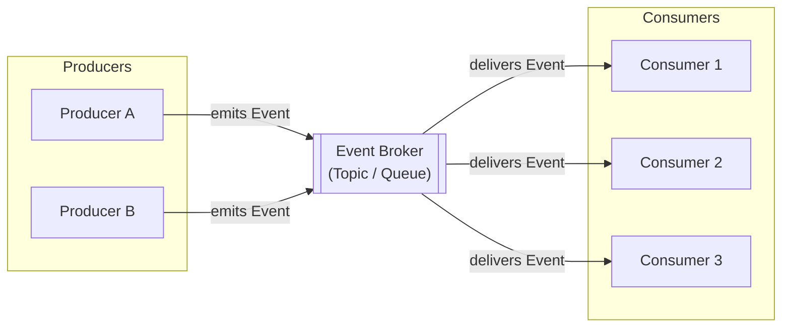
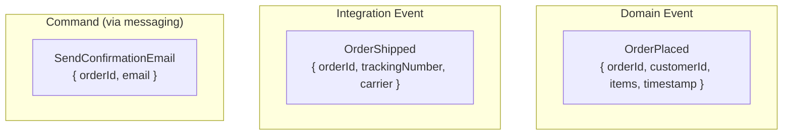

# Event-Driven Architecture

## Overview
Event-driven architecture (EDA) is a style where components communicate by producing and consuming events. Producers emit events when something happens; consumers react to those events independently. Neither side knows about the other directly.

This decouples timing, deployment, and team ownership.

## Structure

## Core concepts
- **Event**: an immutable record of something that happened. Named in past tense (e.g., `OrderPlaced`, `UserRegistered`). Contains all information a consumer needs to react.
- **Producer**: emits events without knowing who consumes them.
- **Consumer**: subscribes to events and reacts independently. Multiple consumers can receive the same event.
- **Event broker**: the infrastructure that routes events from producers to consumers
- **Topic / Queue**: logical channel for a specific type of event.
- **Consumer group**: a set of consumers that share the processing load of a topic.

## Event types

- **Domain events**: things that happened within a bounded context. Used internally.
- **Integration events**: events shared across service boundaries. Require stable contracts.
- **Commands via messaging**: instructions targeted at a specific service. Less decoupled than events.

## Decision considerations / trade-offs
| | Pro | Con |
|---|---|---|
| Decoupling | Producer and consumer deploy independently | Harder to trace end-to-end request flows |
| Scalability | Consumers scale independently | Event ordering and deduplication require careful design |
| Resilience | Broker buffers events if consumer is temporarily down | Broker becomes a critical dependency |
| Auditability | Event log is a natural audit trail | Event schema changes require versioning strategy |
| Flexibility | Add new consumers without touching producers | Eventual consistency — consumers lag behind producers |

## When to use / when not to use
- **Use when**: multiple services react to the same trigger (fan-out).
- **Use when**: audit trails or event replay are required.
- **Use when**: producer and consumer need independent deployment and scaling.
- **Use when**: workflows span multiple services over time (e.g., order fulfillment pipeline).
- **Avoid when**: the caller needs an immediate result.
- **Avoid when**: the team has no tooling to trace events across services or handle failed events.
- **Avoid when**: eventual consistency is unacceptable for a given operation.

## Practical examples
- `Orders` publishes `OrderPlaced`; `Billing`, `Inventory`, and `Notifications` each consume it independently.
- `PaymentService` publishes `PaymentFailed`; a retry workflow is triggered by a consumer.
- Event log in Kafka used to rebuild read models (projections) for analytics.

## Patterns commonly used with EDA

- **Outbox pattern**: write events to a local outbox table atomically with the domain change, then publish asynchronously. Prevents lost events.
- **Dead letter queue**: events that fail processing are moved to a DLQ for inspection and replay.
- **Saga**: manage multi-step workflows across services using events and compensating actions.
- **Event sourcing**: store state as a sequence of events rather than current state.

## Common pitfalls
- **Event schema drift**: producers change event structure without versioning, breaking consumers.
- **Missing dead letter queues**: failed events silently disappear without a DLQ.
- **Large event payloads**: events carry full entity state instead of just what changed. Use event + fetch pattern for large data.
- **God topic**: all events on a single topic, making it impossible to scale or manage independently.
- **No tracing**: without correlation IDs and distributed tracing, debugging cross-service flows is very hard.
