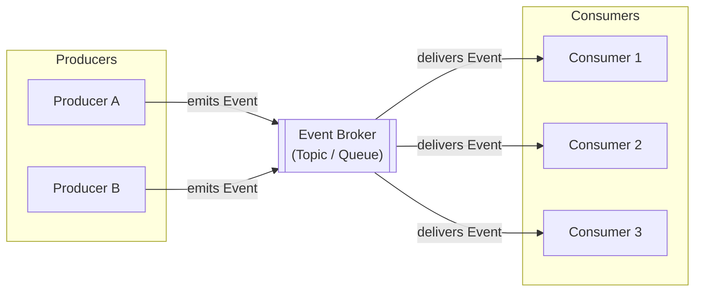
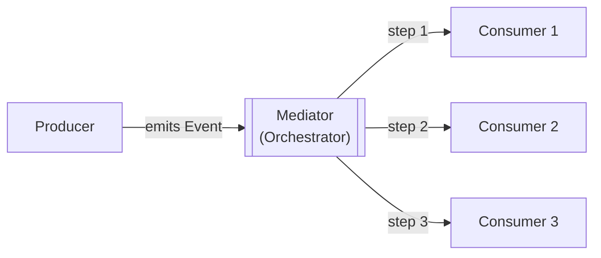
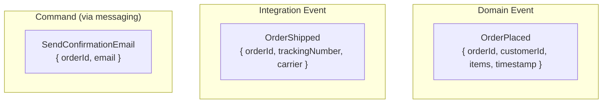
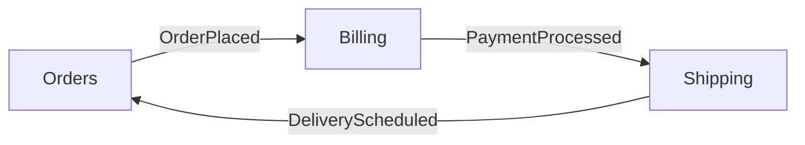
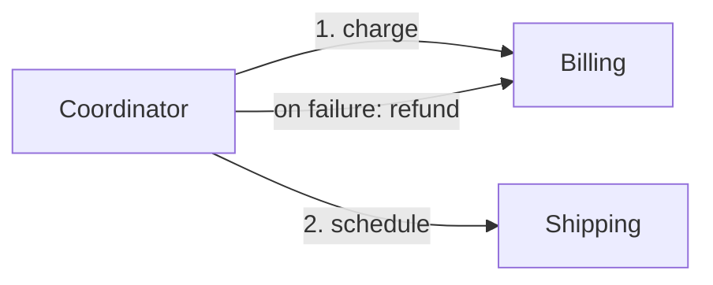

# Event-Driven Architecture

## Overview
Event-driven architecture (EDA) is a style where components communicate by producing and consuming events. Producers emit events when something happens; consumers react to those events independently. Neither side knows about the other directly.

This decouples timing, deployment, and team ownership.

## Topology

### Broker Topology

Producers emit events to a central broker (e.g., Kafka, RabbitMQ). Consumers subscribe independently. No central coordination. The broker only routes and delivers.

```mermaid
flowchart LR
  subgraph Producers
    P1["Producer A"]
    P2["Producer B"]
  end

  Broker[["Event Broker\n(Topic / Queue)"]]

  subgraph Consumers
    C1["Consumer 1"]
    C2["Consumer 2"]
    C3["Consumer 3"]
  end

  P1 -->|"emits Event"| Broker
  P2 -->|"emits Event"| Broker
  Broker -->|"delivers Event"| C1
  Broker -->|"delivers Event"| C2
  Broker -->|"delivers Event"| C3
```

### Mediator Topology

Events are routed through a central mediator (e.g., an orchestrator or workflow engine). The mediator knows the process steps and coordinates which consumers are called and in what order.

```mermaid
flowchart LR
  P["Producer"]
  M[["Mediator\n(Orchestrator)"]]
  C1["Consumer 1"]
  C2["Consumer 2"]
  C3["Consumer 3"]

  P -->|"emits Event"| M
  M -->|"step 1"| C1
  M -->|"step 2"| C2
  M -->|"step 3"| C3
```

| | Broker | Mediator |
|---|---|---|
| Coordination | Decentralized — consumers decide what to do | Centralized — mediator controls the flow |
| Coupling | Low — producer and consumer don't know each other | Medium — mediator knows all steps |
| Visibility | Harder to see end-to-end flow | Flow is explicit and auditable in one place |
| Use when | Fan-out, independent reactions, scalability | Multi-step workflows, ordered processing, error handling across steps |

## Core concepts
- **Event**: an immutable record of something that happened. Named in past tense (e.g., `OrderPlaced`, `UserRegistered`). Contains all information a consumer needs to react.
- **Producer**: emits events without knowing who consumes them.
- **Consumer**: subscribes to events and reacts independently. Multiple consumers can receive the same event.
- **Event broker**: the infrastructure that routes events from producers to consumers
- **Topic / Queue**: logical channel for a specific type of event.
- **Consumer group**: a set of consumers that share the processing load of a topic.

## Event types

```mermaid
flowchart TB
  subgraph "Domain Event"
    DE["OrderPlaced\n{ orderId, customerId, items, timestamp }"]
  end

  subgraph "Integration Event"
    IE["OrderShipped\n{ orderId, trackingNumber, carrier }"]
  end

  subgraph "Command (via messaging)"
    CMD["SendConfirmationEmail\n{ orderId, email }"]
  end
```

- **Domain events**: things that happened within a bounded context. Used internally.
- **Integration events**: events shared across service boundaries. Require stable contracts.
- **Commands via messaging**: instructions targeted at a specific service. Less decoupled than events.

## Decision considerations / trade-offs
| | Pro | Con |
|---|---|---|
| Decoupling | Producer and consumer deploy independently | Harder to trace end-to-end request flows |
| Scalability | Consumers scale independently | Event ordering and deduplication require careful design |
| Resilience | Broker buffers events if consumer is temporarily down | Broker becomes a critical dependency |
| Auditability | Event log is a natural audit trail | Event schema changes require versioning strategy |
| Flexibility | Add new consumers without touching producers | Eventual consistency — consumers lag behind producers |

## When to use / when not to use
- **Use when**: multiple services react to the same trigger (fan-out).
- **Use when**: audit trails or event replay are required.
- **Use when**: producer and consumer need independent deployment and scaling.
- **Use when**: workflows span multiple services over time (e.g., order fulfillment pipeline).
- **Avoid when**: the caller needs an immediate result.
- **Avoid when**: the team has no tooling to trace events across services or handle failed events.
- **Avoid when**: eventual consistency is unacceptable for a given operation.

## Practical examples
- `Orders` publishes `OrderPlaced`; `Billing`, `Inventory`, and `Notifications` each consume it independently.
- `PaymentService` publishes `PaymentFailed`; a retry workflow is triggered by a consumer.
- Event log in Kafka used to rebuild read models (projections) for analytics.

## Patterns commonly used with EDA

- **Outbox pattern**: write events to a local outbox table atomically with the domain change, then publish asynchronously. Prevents lost events.
- **Dead letter queue**: events that fail processing are moved to a DLQ for inspection and replay.
- **[Saga](#saga-managing-multi-step-workflows)**: manage multi-step workflows across services using events and compensating actions.
- **Event sourcing**: store state as a sequence of events rather than current state.

## Saga: managing multi-step workflows

A [saga](../foundations/glossary.md#saga) breaks a long-running operation into smaller steps. Each step is handled by a different service. If a step fails, the saga runs [compensating actions](../foundations/glossary.md#compensating-action) to undo the steps that already completed.

**Example — placing an order:**
1. Reserve stock
2. Charge the customer
3. Schedule delivery

If step 3 fails, the saga runs in reverse: refund the charge, release the reserved stock. The system ends up in a clean state even though not all steps succeeded.

### Two ways to coordinate a saga

**Choreography** — each service reacts to events and decides what to do next on its own. There is no central coordinator.

```mermaid
flowchart LR
  Orders -->|"OrderPlaced"| Billing
  Billing -->|"PaymentProcessed"| Shipping
  Shipping -->|"DeliveryScheduled"| Orders
```

**Orchestration** — a central coordinator sends instructions to each service and tracks the overall progress.

```mermaid
flowchart LR
  Coordinator -->|"1. charge"| Billing
  Coordinator -->|"2. schedule"| Shipping
  Coordinator -->|"on failure: refund"| Billing
```

| | Choreography | Orchestration |
|---|---|---|
| Who controls the flow | No one — each service reacts independently | A central coordinator |
| Visibility | Hard to see the full picture in one place | The full flow is visible in the coordinator |
| Coupling | Low — services do not know each other | Medium — the coordinator knows all services |
| Best for | Simple flows with few failure cases | Complex flows with many steps or conditions |

### When to use sagas

- Use when a workflow spans multiple services and all steps must succeed together, or all must be undone.
- Choreography works well for simple fan-out flows where failure handling is straightforward.
- Orchestration is easier to manage when the flow has many steps, conditional logic, or complex error handling.

## Common pitfalls
- **Event schema drift**: producers change event structure without versioning, breaking consumers.
- **Missing dead letter queues**: failed events silently disappear without a DLQ.
- **Large event payloads**: events carry full entity state instead of just what changed. Use event + fetch pattern for large data.
- **God topic**: all events on a single topic, making it impossible to scale or manage independently.
- **No tracing**: without correlation IDs and distributed tracing, debugging cross-service flows is very hard.
