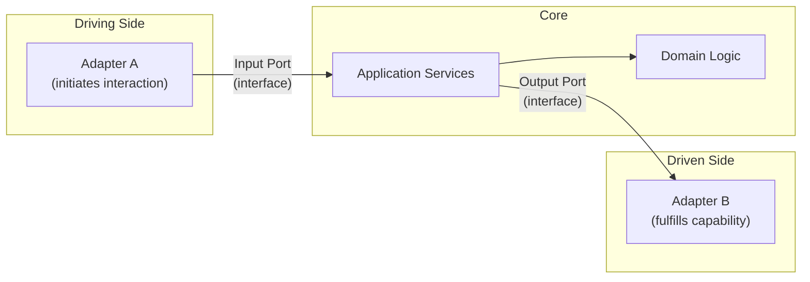

# Hexagonal Architecture (Ports & Adapters)

## Overview
Hexagonal architecture isolates core business logic from all external systems — databases, UIs, message brokers, third-party APIs. The core defines *ports* (interfaces), and *adapters* implement those interfaces for specific technologies.

The result: the core can be tested and evolved without touching infrastructure, and infrastructure can be swapped without touching the core.

## Structure

**Driving adapters** (left): call the core — HTTP controllers, CLI commands, test suites.
**Driven adapters** (right): called by the core — database, email, external APIs.
**Ports**: interfaces defined by the core, implemented by adapters.

## Core concepts
- **Port**: an interface that the core defines and uses. It represents a capability (e.g., `OrderRepository`, `NotificationSender`).
- **Adapter**: a concrete implementation of a port for a specific technology (e.g., `PostgresOrderRepository`, `SendgridNotificationSender`).
- **Dependency rule**: the core never imports from adapters. Adapters import from the core.
- **Symmetry**: the pattern applies equally to input (driving) and output (driven) sides.

## Decision considerations / trade-offs
| | Pro | Con |
|---|---|---|
| Testability | Core logic tested without infrastructure | More interfaces and classes to maintain |
| Flexibility | Swap database, broker, or UI without core changes | Boilerplate increases for simple CRUD-heavy systems |
| Isolation | External system failures don't affect domain logic directly | Mapping between domain and adapter models adds effort |
| Dependency clarity | No accidental coupling to frameworks or ORMs | Requires discipline to enforce the boundary |

## When to use / when not to use
- **Use when**: external systems (payments, identity providers, CRMs) change often.
- **Use when**: you need deep test coverage of business logic without external dependencies.
- **Use when**: vendor lock-in is a real risk.
- **Avoid when**: the team is very small and the system has minimal external integrations.
- **Avoid when**: a simple layered architecture meets the same need with less overhead.

## Practical examples
- Payment service where `PaymentGateway` is a port, implemented by `StripeAdapter` and `PaypalAdapter`.
- Notification service where `NotificationSender` is a port, switchable between email, SMS, or webhook adapters.
- Test suite that drives the core via the input port without starting an HTTP server.

## Common pitfalls
- **Leaking framework types** into the core (e.g., using an ORM entity as a domain object).
- **Port explosion**: defining a separate port for every single database call instead of grouping by capability.
- **Adapter logic creep**: business logic drifts into adapters instead of staying in the core.