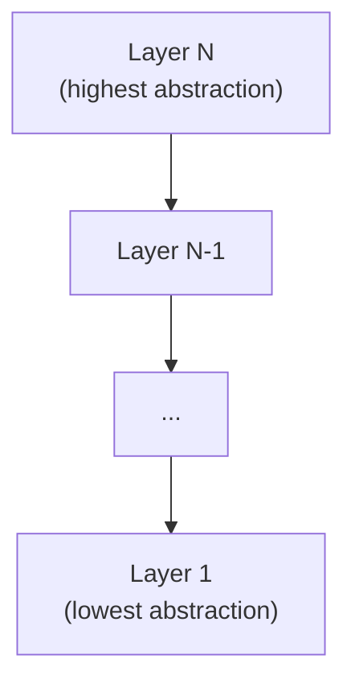

# Layered Architecture

## Overview
Layered architecture organizes a system into horizontal layers, each with a specific responsibility. Dependencies flow in one direction: upper layers depend on lower layers, never the reverse.

The most common form has four layers: presentation, application, domain, and infrastructure.

## Structure

Each layer has a single, well-defined responsibility. Dependencies flow strictly downward — upper layers may call lower layers, but never the reverse.

## Core concepts
- **Presentation layer**: handles user input and output. Controllers, views, API handlers.
- **Application layer**: coordinates use cases. Calls domain logic and infrastructure. Has no business rules of its own.
- **Domain layer**: contains business rules, entities, and value objects. Has no knowledge of databases or frameworks.
- **Infrastructure layer**: handles persistence, external services, messaging, and I/O.

## Decision considerations / trade-offs
| | Pro | Con |
|---|---|---|
| Dependency direction | Easy to reason about; testable domain | Infrastructure concerns can leak upward |
| Layered separation | Clear ownership per layer | Adding cross-cutting concerns (e.g., logging, auth) requires extra care |
| Testability | Domain layer is framework-free | Application tests often require mocking multiple layers |
| Change cost | Isolated changes within a layer are cheap | Changes that span multiple layers are expensive |

## When to use / when not to use
- **Use when**: the domain is stable, the team is small, and deployment simplicity matters.
- **Use when**: you want a starting point before extracting services.
- **Avoid when**: many cross-cutting concerns dominate the design.
- **Avoid when**: teams need independent release cycles for different functional areas.

## Practical examples
- A REST API with controllers -> service classes -> repositories -> database.
- A backend application where domain validation never imports from ORM or HTTP frameworks.
- Starting architecture for a new product before scaling needs are clear.

## Common pitfalls
- **Anemic domain model**: domain layer holds only data, business logic leaks into the application layer.
- **Layer skipping**: UI directly calls infrastructure, bypassing domain logic.
- **God service**: application layer grows into a large class with hundreds of methods.
