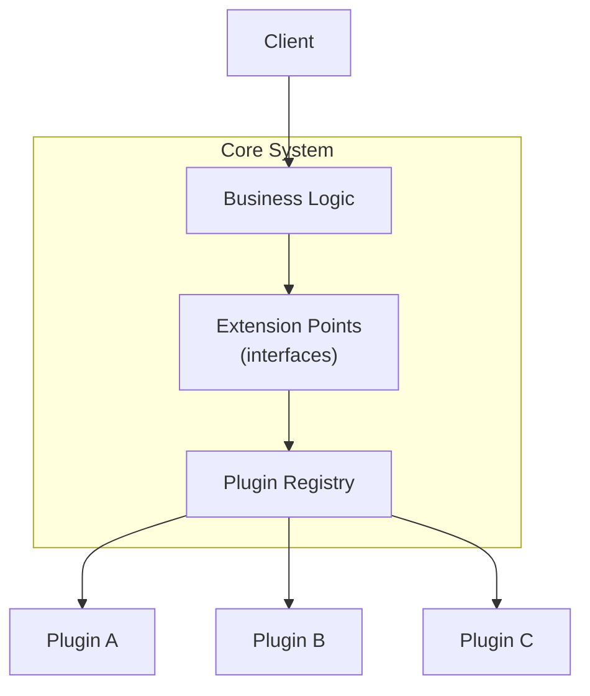

# Microkernel Architecture (Plugin Architecture)

## Overview
Microkernel architecture divides a system into a **core** that implements the fundamental business logic and a set of **plug-ins** that extend or specialize that logic. The core defines extension points; plug-ins implement them. New capabilities are added as plug-ins without modifying the core.

## Topology

The core calls out to plug-ins at defined extension points. Plug-ins implement those interfaces and are registered at startup or runtime. Plug-ins do not call each other directly.

## Core concepts
- **Core**: contains the essential, stable business rules and the interfaces that plug-ins must implement. Changes rarely.
- **Plug-in**: a self-contained module that implements a core-defined interface. Adds a feature, handles a product variant, or encapsulates domain-specific rules.
- **Extension point**: an interface defined by the core that marks where plug-in behavior can be injected. The stability of these interfaces determines how often plug-ins need to change.
- **Registry**: the mechanism that maps extension points to concrete plug-in implementations at runtime (configuration file, DI container, service locator).

## Decision considerations / trade-offs

| | Pro | Con |
|---|---|---|
| Extensibility | New features added without touching core logic | Extension point changes require updates across all plug-ins |
| Isolation | A broken plug-in can be disabled without affecting the core | Inter-plug-in dependencies are difficult to manage |
| Independent release | Plug-ins ship on their own schedule | Discovery and lifecycle management add runtime complexity |
| Changeability | Variable or customer-specific logic lives outside the core | Deciding what belongs in the core vs. a plug-in requires discipline |

## When to use / when not to use
- **Use when**: the system has stable core rules but many varying extensions — product variants, customer-specific logic, jurisdiction-specific regulations.
- **Use when**: different feature sets evolve at different speeds and must not block each other.
- **Use when**: external teams or third parties need to contribute capabilities without access to the core.
- **Avoid when**: the feature set is fixed and unlikely to grow. The extension-point machinery adds overhead for no benefit.
- **Avoid when**: plug-ins need to coordinate heavily with each other; strong inter-plug-in coupling defeats the design.
- **Avoid when**: dynamic plug-in loading conflicts with strict latency or startup-time requirements.

## Practical examples
- **Insurance platform**: core handles the universal claims process; plug-ins implement product-specific or country-specific calculation rules.
- **Tax engine**: core drives the calculation workflow; plug-ins provide jurisdiction-specific rules.
- **IDE** (VS Code, IntelliJ): core manages the editor model; language support, debuggers, and linters are plug-ins.
- **Build tool** (Webpack, Gradle): core runs the build pipeline; loaders, transformers, and reporters are plug-ins.
- **CMS** (WordPress, Drupal): core manages content lifecycle; themes, content types, and integrations are plug-ins.

## Common pitfalls
- **Unstable extension points**: changing the core interfaces forces simultaneous updates in every plug-in. Treat them like a public API and version deliberately.
- **Core without logic**: pushing too much into plug-ins until the core is just plumbing. If the core has no real business rules, the boundary is in the wrong place.
- **Wrong logic in core**: embedding variant or customer-specific rules directly in the core instead of a plug-in, making the core grow and change too often.
- **Hidden inter-plug-in coupling**: plug-ins that call each other directly bypass the core's coordination and create the dependency mesh the pattern is meant to avoid.
