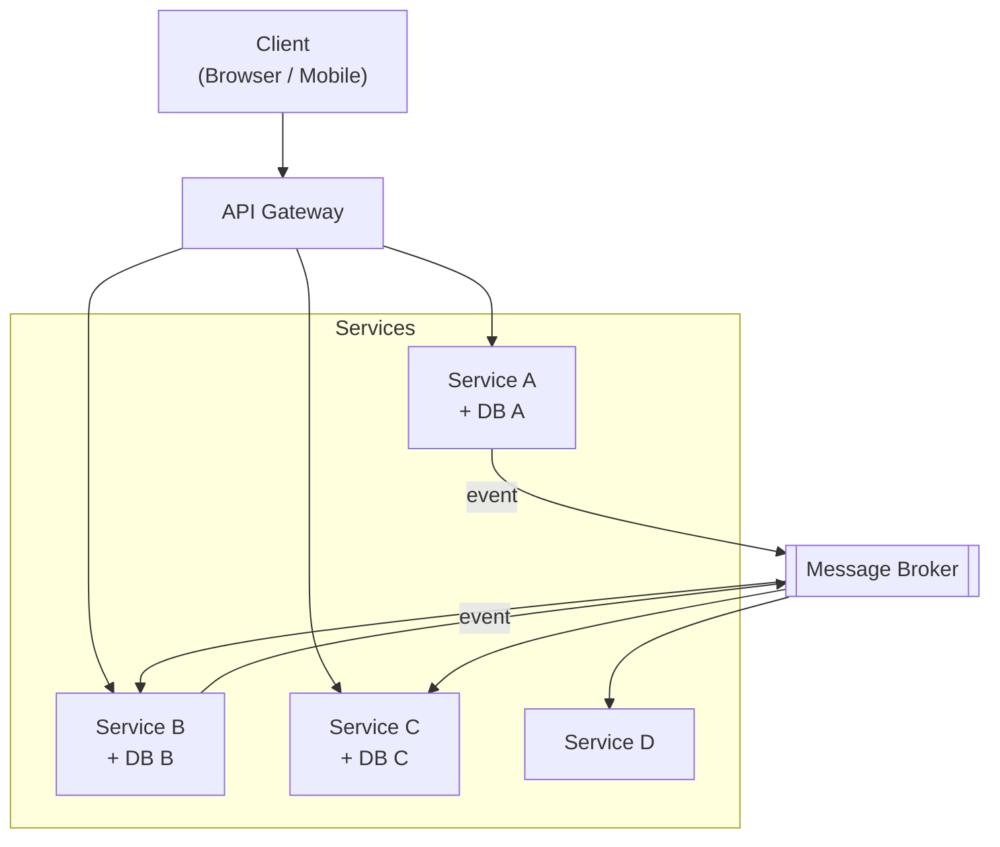

# Microservices

## Overview
Microservices is an architectural style where a system is composed of small, independently deployable services. Each service is owned by a single team, has its own data store, and communicates with other services over the network.

The goal is independent deployability, scalability, and team autonomy — not small code size.

## Structure

## Core concepts
- **Single responsibility**: each service covers exactly one business domain and owns the data within it.
- **Independent deployment**: a service can be deployed without touching anything else.
- **Data isolation**: each service has its own database —> no shared tables, no direct cross-service queries.
- **Network communication**: services talk to each other via HTTP/REST, gRPC, or a message broker.
- **API Gateway**: the single entry point for clients; handles routing, auth, and rate limiting.
- **Bounded context**: service boundaries follow business domains, not technical layers.

## Decision considerations / trade-offs
| | Pro | Con |
|---|---|---|
| Deployment | Each service ships on its own schedule | Every service needs its own CI/CD pipeline |
| Scalability | Scale only what needs scaling | Network hops add latency |
| Team autonomy | Teams work independently | Cross-service changes require coordination |
| Resilience | One service failing doesn't take down the system | Distributed failures are harder to debug |
| Technology | Each service can use a different stack | Running many different stacks adds operational complexity |
| Data | Each service controls its own data model | Queries across services need API calls or eventual consistency |

## When to use / when not to use
- **Use when**: multiple teams need independent deployment and release cadence.
- **Use when**: different parts of the system have significantly different scaling requirements.
- **Use when**: the team can handle the operational complexity (CI/CD, observability, containers).
- **Avoid when**: the team is small and the overhead isn't worth it.
- **Avoid when**: bounded contexts are not yet well understood — wrong boundaries are expensive to fix.
- **Avoid when**: you are building an early-stage product with rapidly changing requirements.

## Practical examples
- An e-commerce platform where `Orders`, `Billing`, `Inventory`, and `Shipping` are separate services with independent deployments.
- `Orders` publishes an `OrderPlaced` event; `Billing` and `Notifications` consume it asynchronously.
- `Inventory` is scaled to 10 instances during peak season; `Notifications` runs at 2 instances.

## Operational requirements
Running microservices requires:
- Container orchestration (Kubernetes or equivalent)
- Centralized logging and distributed tracing
- Service health checks and circuit breakers
- API versioning strategy
- Secrets management

## Common pitfalls
- **Distributed monolith**: services are deployed separately but still tightly coupled via a shared database or long chains of synchronous calls.
- **Too fine-grained services**: services split below the business domain boundary lead to chatty communication and coordination overhead.
- **No observability**: without tracing, debugging failures across services is extremely difficult.
- **Shared database**: the most common mistake. Kills independent deployability immediately.
