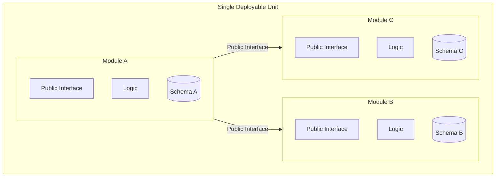

# Modular Monolith

## Overview
A modular monolith is a single deployable unit structured with explicit, enforced module boundaries. Each module owns its functionality and data. Communication between modules happens through defined interfaces, not direct database sharing or internal imports.

It combines the operational simplicity of a monolith with the boundary discipline of a service-oriented architecture.

## Structure

Each module owns its code and data. Cross-module access goes through the public interface only — never via direct schema access or internal imports.

## Core concepts
- **Module boundary**: a hard separation between modules, enforced by code structure or tooling (e.g., package visibility, linting rules, ArchUnit).
- **Public interface**: the only entry point another module can call. Typically a service class or a defined API contract.
- **Private internals**: all implementation details, database schemas, and internal models are hidden from other modules.
- **Single deployment**: all modules compile and deploy together. No network calls between modules.
- **Shared infrastructure**: modules share the same process, runtime, and often the same database — but not the same schema or tables.

## Decision considerations / trade-offs
| | Pro | Con |
|---|---|---|
| Deployment | Simple —> one artifact, no service mesh | Single point of failure |
| Development | Refactoring across modules is easy in one codebase | Discipline needed to enforce boundaries |
| Testing | Integration tests without network overhead | No isolation between module failures at runtime |
| Scalability | Can scale the whole unit vertically | Cannot scale individual modules independently |
| Migration path | Good starting point before extracting services | If boundaries are wrong, extraction is harder later |

## When to use / when not to use
- **Use when**: team is small and independent deployments are not yet needed.
- **Use when**: you want clean domain boundaries without microservices operational overhead.
- **Use when**: building a new product where bounded contexts are still being discovered.
- **Avoid when**: different modules have very different scalability or reliability requirements.
- **Avoid when**: multiple large teams need fully independent release cycles.

## Common pitfalls
- **Module boundary drift**: modules directly import each other's internals over time without enforcement.
- **Shared database schema**: modules share tables, making it impossible to extract a service later.
- **No interface discipline**: bypassing the module's public API leads to tight coupling.

