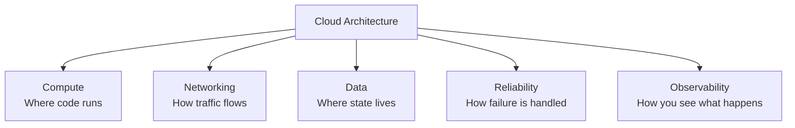
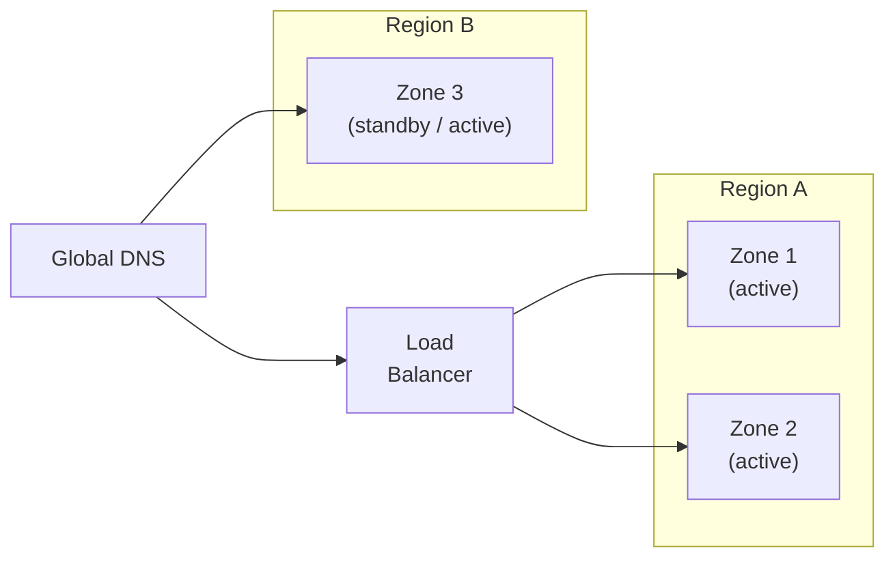

# Cloud Architecture

## Overview
Cloud architecture is the discipline of designing systems that run on shared, remotely operated infrastructure — rather than servers you own and manage yourself.

The shift to cloud is not primarily a technology decision. It is a decision about **who owns which operational concerns**: compute capacity, hardware failures, network redundancy, physical security. Cloud providers absorb those concerns. In return, architects must make intentional choices about how to use the capabilities the cloud exposes.

The core questions cloud architecture answers:

> Where does my code run? Where does my data live? How does traffic reach my system? What happens when something fails? How do I know what is happening?

---

## The five pillars

Every cloud architecture must address five fundamental concerns. Neglecting any one of them will eventually surface as an incident or cost problem.

| Pillar | Core question | Examples |
|---|---|---|
| **Compute** | What model runs my workload? | Virtual machines, containers, serverless functions |
| **Networking** | How does traffic reach my services? | Load balancers, CDN, DNS, API gateways |
| **Data** | Where does state live and who can access it? | Managed databases, object storage, caches |
| **Reliability** | What is my tolerance for downtime and data loss? | Redundancy, failover, backups, recovery targets |
| **Observability** | How do I know my system is healthy? | Logs, metrics, traces, alerts |

Security cuts across all five pillars — it is not a separate concern added at the end, but a property of how each pillar is designed.

---

## Compute models

The most consequential early decision in cloud architecture is the compute model. It determines how much you control versus how much the platform manages.

| Model | You manage | Platform manages | Best for |
|---|---|---|---|
| **Virtual machines** | OS, runtime, scaling | Hardware, hypervisor | Full control, legacy workloads |
| **Containers** | Application, configuration | OS (partial), scheduling | Consistent environments, microservices |
| **Serverless** | Business logic only | Everything else | Event-driven, unpredictable traffic |
| **Managed services** | Configuration only | Compute, scaling, patching | Databases, queues, caches |

No single model is correct. Most systems use a mix: containers for long-running services, serverless for event processing, managed services for data.

---

## Availability and failure

Cloud infrastructure fails. Hardware breaks, network links drop, entire data centers become unavailable. Cloud architecture assumes failure is normal and designs for it explicitly.

**Availability zones** are isolated data centers within a region. Distributing across zones protects against single-facility failures.

**Regions** are geographic locations. Multi-region deployment protects against large-scale outages and reduces latency for global users.

The right level of redundancy depends on your **availability target** and **data sensitivity** — not on what is technically possible.

---

## Key trade-offs

| Decision | Benefit | Cost |
|---|---|---|
| Multi-region deployment | Higher availability, lower latency globally | Data complexity, synchronization overhead, cost |
| Serverless compute | No infrastructure management, scales to zero | Cold starts, vendor lock-in, harder local development |
| Managed services | Reduced operational burden | Less control, potential for vendor dependency |
| Strong observability | Faster diagnosis, shorter outages | Additional infrastructure and ingestion cost |
| Infrastructure as code | Repeatable, auditable deployments | Upfront investment in tooling and discipline |

---

## How to approach cloud architecture decisions

Cloud architecture decisions compound. An early choice like compute model, cloud provider and data location shapes everything that follows. Treat them deliberately.

**Start with requirements, not services.**
Define your availability target, data residency constraints, expected traffic pattern, and team operational maturity *before* choosing specific cloud products.

**Design for the failure you can tolerate.**
Identify what a 10-minute outage costs versus a 24-hour outage. Let that drive redundancy decisions. Not every system needs multi-region active-active.

**Match operational complexity to team capability.**
A Kubernetes cluster gives full control but requires significant expertise to operate safely. A fully managed platform reduces control but reduces operational risk.

**Prefer managed over self-hosted by default.**
Let the cloud provider manage databases, queues, and caches unless there is a concrete reason not to. The marginal cost of control is usually not worth it early on.

---

## Common pitfalls

- **Lift-and-shift without rethinking**: moving servers to the cloud without adapting the architecture gains little and inherits all existing operational debt.
- **Overbuilding for scale**: designing for millions of users before you have thousands adds cost and complexity without benefit.
- **Ignoring failure modes**: assuming cloud infrastructure is reliable leads to systems with no retry logic, no circuit breakers, and no graceful degradation.
- **Treating security as an afterthought**: IAM policies, secrets management, and network boundaries need to be designed in, not added on.
- **No observability plan**: deploying without structured logging, metrics, and alerting means the first real incident takes hours to diagnose.

---
