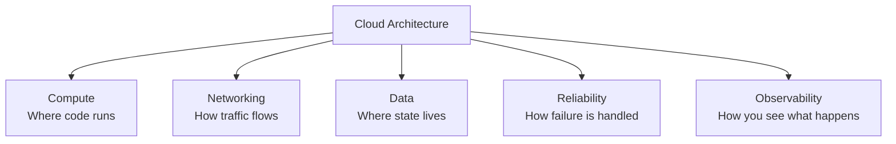

# Cloud Architecture

## Overview
Cloud architecture is the discipline of designing systems that run on shared, remotely operated infrastructure, rather than servers you own and manage yourself.

The shift to cloud is not primarily a technology decision. It is a decision about **who owns which operational concerns**: compute capacity, hardware failures, network redundancy, physical security. Cloud providers absorb those concerns. In return, architects must make intentional choices about how to use the capabilities the cloud exposes.

The core questions cloud architecture answers:

> Where does my code run? Where does my data live? How does traffic reach my system? What happens when something fails? How do I know what is happening?

---

## The five pillars

Cloud architectures generally need to address five fundamental concerns; neglecting any one of them can later surface as an incident or cost problem.

```mermaid
flowchart TD
  Arch["Cloud Architecture"]
  Arch --> C["Compute\nWhere code runs"]
  Arch --> N["Networking\nHow traffic flows"]
  Arch --> D["Data\nWhere state lives"]
  Arch --> R["Reliability\nHow failure is handled"]
  Arch --> O["Observability\nHow you see what happens"]
```

| Pillar | Core question | Examples |
|---|---|---|
| **Compute** | What model runs my workload? | Virtual machines, containers, serverless functions |
| **Networking** | How does traffic reach my services? | Load balancers, CDN, DNS, API gateways |
| **Data** | Where does state live and who can access it? | Managed databases, object storage, caches |
| **Reliability** | What is my tolerance for downtime and data loss? | Redundancy, failover, backups, recovery targets |
| **Observability** | How do I know my system is healthy? | Logs, metrics, traces, alerts |

Security cuts across all five pillars. It is not a separate concern added at the end, but a property of how each pillar is designed.

---

## Topics

| Topic | Concern |
|---|---|
| [Compute](compute.md) | The model that runs a workload: virtual machines, containers, serverless, managed services |
| [Networking](networking.md) | The path traffic takes to a service: DNS, CDN, load balancers, API gateways, network boundaries |
| [Data](data.md) | Where state lives and who can reach it: managed stores, object storage, caches, residency |
| [Reliability](reliability.md) | Designing for failure: availability zones, regions, redundancy, recovery targets |
| [Infrastructure as Code](infrastructure-as-code.md) | Provisioning infrastructure as versioned, repeatable definitions |
| [Cost](cost.md) | How architectural choices translate into a recurring bill |

Observability is a cloud pillar but a cross-cutting concern in its own right; it is treated in a dedicated section of the guide.

---

## How to approach cloud architecture decisions

Cloud architecture decisions compound. An early choice like compute model, cloud provider and data location shapes everything that follows. Treat them deliberately.

**Start with requirements, not services.**
Define your availability target, data residency constraints, expected traffic pattern, and team operational maturity *before* choosing specific cloud products.

**Design for the failure you can tolerate.**
Identify what a 10-minute outage costs versus a 24-hour outage. Let that drive redundancy decisions. Not every system needs multi-region active-active.

**Match operational complexity to team capability.**
A Kubernetes cluster gives full control but requires significant expertise to operate safely. A fully managed platform reduces control but reduces operational risk.

**Consider managed over self-hosted as a starting point.**
Managed services for databases, queues, and caches are often a reasonable default. The added control of self-hosting may not justify its operational cost early in a project.

---

## How these topics connect

- **The compute model sets the cost shape.** Scale-to-zero and always-on workloads bill differently, so a [compute](compute.md) choice is also a [cost](cost.md) choice.
- **Data location constrains reliability and latency.** Where [data](data.md) lives determines which [reliability](reliability.md) strategies and which regions are even available.
- **Networking is the seam to every pillar.** Traffic crosses [networking](networking.md) before any compute runs, and cross-region paths reappear as [cost](cost.md) and [reliability](reliability.md) concerns.
- **Infrastructure as Code makes the rest repeatable.** [Compute](compute.md), [networking](networking.md), and [data](data.md) decisions only stay consistent across environments when they are defined as [code](infrastructure-as-code.md).

---

## Common pitfalls

- **Lift-and-shift without rethinking**: moving servers to the cloud without adapting the architecture gains little and inherits all existing operational debt.
- **Overbuilding for scale**: designing for millions of users before you have thousands adds cost and complexity without benefit.
- **Treating security as an afterthought**: IAM policies, secrets management, and network boundaries need to be designed in, not added on.
- **No observability plan**: deploying without structured logging, metrics, and alerting means the first real incident takes hours to diagnose.

Pillar-specific pitfalls are covered on each topic page.

---
