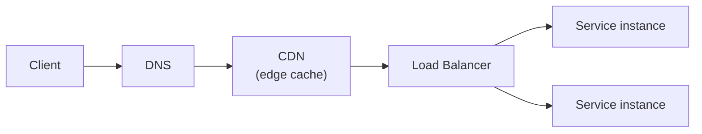

# Networking

## Overview
Networking is the path traffic takes to reach a service and the boundaries that control it. It is the seam between users and every other pillar: a request crosses DNS, edge caches, and load balancers before any compute runs.

---

## The request path

A request resolves a name (DNS), may be served from an edge cache (CDN), is distributed across healthy instances (load balancer), and only then reaches compute. Each hop is a place to add caching, routing, or failover.

---

## Core components

| Component | Role |
|---|---|
| **DNS** | Resolves a domain name to an address; the first routing decision. Supports failover and geographic routing. |
| **CDN** | Caches static content at edge locations close to users, reducing latency and origin load. |
| **Load balancer** | Distributes traffic across healthy instances; operates at the transport layer (L4) or application layer (L7). |
| **API gateway** | A single entry point for APIs; handles routing, authentication, rate limiting, and request shaping. |

---

## Network boundaries

Cloud networks are private by default within a virtual network, with explicit rules for what may enter (**ingress**) and leave (**egress**). Public exposure is a deliberate choice, not a starting point. Segmenting services into private subnets and exposing only the entry point reduces the attack surface.

---

## Trade-offs

| Decision | Benefit | Cost |
|---|---|---|
| CDN for static content | Lower latency, less origin load | Cache invalidation complexity |
| L7 load balancing | Routing on paths, headers, and hosts | More processing per request than L4 |
| API gateway | Centralises cross-cutting concerns | A shared dependency on the request path |
| Private-by-default networking | Smaller attack surface | More configuration to expose a service |

---

## Common pitfalls

- **Public by default**: exposing services directly to the internet instead of routing through a controlled entry point widens the attack surface.
- **No CDN for static assets**: serving images, scripts, and downloads from the origin wastes bandwidth and adds latency for distant users.
- **Load balancer as a hidden single point of failure**: the entry point itself needs redundancy across zones.
- **Unbudgeted egress**: data leaving the provider's network is billed; cross-region and internet egress can dominate the bill (see [Cost](cost.md)).

---
