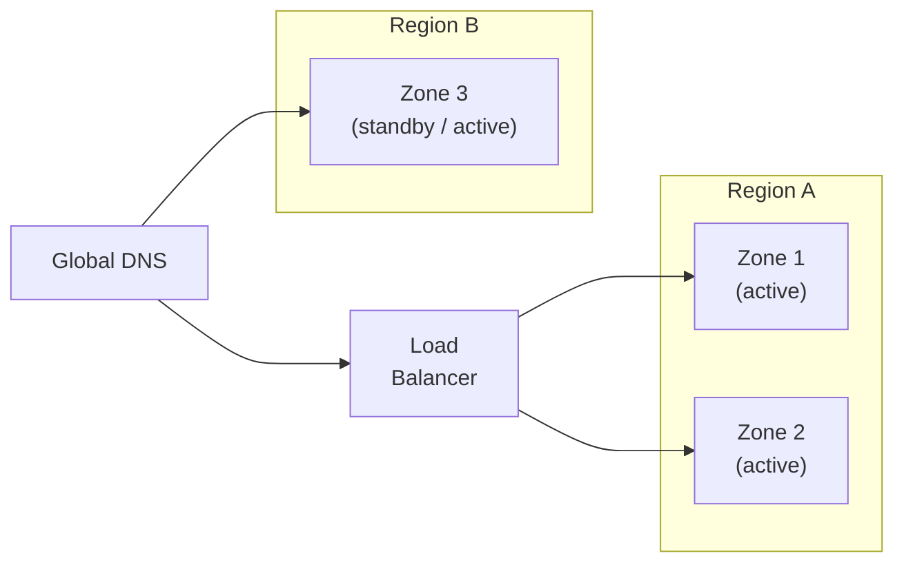

# Reliability

## Overview
Cloud infrastructure fails. Hardware breaks, network links drop, and entire data centres become unavailable. Cloud reliability assumes failure is normal and designs for it explicitly, rather than treating it as an exception.

---

## Availability zones and regions

**Availability zones** are isolated data centres within a region. Distributing across zones protects against single-facility failures.

**Regions** are geographic locations. Multi-region deployment protects against large-scale outages and reduces latency for global users.

The right level of redundancy depends on your **availability target** and **data sensitivity** — not on what is technically possible.

---

## Redundancy strategies

| Strategy | Description | Trade-off |
|---|---|---|
| Single zone | One facility | Cheapest; no protection against facility failure |
| Multi-zone | Redundancy within a region | Protects against zone loss; modest cost increase |
| Active-passive multi-region | Standby region promoted on failure | Survives region loss; standby capacity sits idle |
| Active-active multi-region | All regions serve traffic | Lowest latency, highest availability; data synchronisation is hard |

---

## Recovery targets

Two targets quantify acceptable loss and drive the strategy:

- **RTO (Recovery Time Objective)**: how long the system may be unavailable after a failure.
- **RPO (Recovery Point Objective)**: how much recent data may be lost, measured in time.

Tight RTO/RPO targets push toward multi-region and frequent replication; loose targets allow simpler, cheaper designs. Define them from what an outage actually costs (see [Availability](../quality-attributes/reliability/availability.md) and [Recoverability](../quality-attributes/reliability/recoverability.md)).

---

## Trade-offs

| Decision | Benefit | Cost |
|---|---|---|
| Multi-region deployment | Higher availability, lower global latency | Data complexity, synchronisation overhead, cost |
| Multi-zone redundancy | Survives a facility failure | Modest cost and configuration increase |
| Frequent backups / low RPO | Less data lost on failure | Storage cost and write overhead |

---

## Common pitfalls

- **Untested restores**: backups that have never been restored are unproven. Test recovery on a schedule, not during an incident.
- **Single-zone deployment by default**: running in one availability zone inherits its failures; spread critical workloads across zones.
- **Assuming the infrastructure is reliable**: without retries, timeouts, and fallback behaviour, a single dependency failure cascades. Designing for failure at the application level complements infrastructure redundancy.
- **One redundancy level for everything**: not every workload needs multi-region. Match redundancy to each workload's availability target.

---
