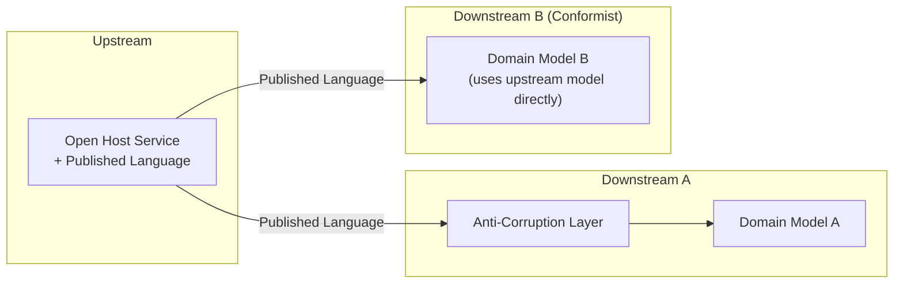

# Context Maps

## Overview
A context map describes how [bounded contexts](strategic-design.md) relate to each other. It captures the integration patterns between contexts, the direction of dependency, and which team has power over the shared interface.

Drawing a context map is not optional in any non-trivial system. Two contexts that ignore each other do not exist; if they share data, users, or workflows, the relationship has a shape. Naming that shape is what a context map does.

## Why an explicit map
Without an explicit map, integration decisions are made implicitly and inconsistently. One pair of contexts shares a database table. Another exchanges JSON over HTTP. A third reads each other's source code. Each pairing has different coupling, different failure modes, and different upgrade cost.

A context map makes the relationships visible. Once visible, they become a deliberate design choice.

## Upstream and downstream
Most relationship patterns are described in terms of *upstream* and *downstream* contexts. The terms describe direction of influence, not direction of data flow.

- **Upstream** decides the model or contract. Changes here propagate outward.
- **Downstream** has to absorb those decisions.

A context can be upstream in one relationship and downstream in another.

**Example.** An *Order* context calls a *Payment* context to charge a credit card. The *Order* sends the HTTP request, but *Payment* defines the API and changes it when it likes. *Payment* is upstream; *Order* is downstream — even though the request travels from *Order* to *Payment*.

## Relationship patterns

DDD describes a small set of named relationship patterns. They differ along two axes: the direction of dependency (who needs whom) and the power balance (who controls the interface, i.e., which side is upstream).

### Partnership
Two contexts depend on each other and succeed or fail together. Coordination is continuous; release schedules are aligned.

- **Power balance:** symmetric.
- **Coupling:** high — both sides change together.
- **When it fits:** two teams whose work is so intertwined that decoupling them would create more friction than coordinating.
- **When it does not fit:** teams that should be able to release independently. Partnership locks them together.

### Shared Kernel
Two contexts share a small, explicit subset of the model (types, code, schema). Changes to the shared kernel require agreement from both sides.

- **Power balance:** symmetric, with shared ownership.
- **Coupling:** medium — limited to the kernel, but tight on what it covers.
- **When it fits:** a small set of concepts both contexts genuinely need to agree on (e.g., a shared *Money* value object, a shared event schema).
- **When it does not fit:** a large shared model. The kernel becomes a hidden canonical model with all its drawbacks.

### Customer / Supplier
One context (downstream) depends on another (upstream), and the upstream team accepts the downstream's needs as input to its backlog. The supplier accommodates the customer.

- **Power balance:** downstream has influence on upstream's roadmap.
- **Coupling:** medium — the interface is negotiated rather than forced.
- **When it fits:** two teams in the same organisation with aligned incentives.
- **When it does not fit:** the upstream team has competing priorities or no incentive to serve the downstream's needs.

### Conformist
The downstream context adopts the upstream's model as-is. No translation, no resistance. The downstream lives with whatever the upstream provides.

- **Power balance:** upstream has all the power.
- **Coupling:** high — every upstream change reaches the downstream model directly.
- **When it fits:** the upstream is a large, stable system (often external) that is not going to change for the downstream. The cost of conforming is lower than the cost of translating.
- **When it does not fit:** the upstream's model is a poor fit for the downstream's domain. Conformity then pollutes the downstream model.

### Anti-Corruption Layer (ACL)
The downstream context translates the upstream's model into its own. The translation layer absorbs the upstream's quirks, naming, and data shape.

- **Power balance:** the downstream protects itself from the upstream.
- **Coupling:** low — coupling is contained in the translation layer; the domain model stays independent.
- **When it fits:** the upstream model is messy, legacy, or external, and pulling its concepts directly into the downstream would damage the downstream's [ubiquitous language](ubiquitous-language.md).
- **When it does not fit:** the upstream is well-modelled and stable; the ACL becomes pure overhead.

### Open Host Service (OHS)
The upstream context exposes a well-defined, documented protocol or API designed for multiple consumers. Each consumer reads the protocol and integrates without bespoke negotiation.

- **Power balance:** upstream defines the contract; many downstreams use it.
- **Coupling:** low — coupling is to the published contract, not to internal models.
- **When it fits:** the upstream is consumed by several contexts, and per-consumer integration would not scale.
- **When it does not fit:** there is only one consumer. A bespoke integration is cheaper than designing a general protocol.

### Published Language
A well-known, often standardised, data format used between contexts. Frequently combined with Open Host Service: the host exposes the protocol, the language is the format the protocol speaks.

- **Power balance:** the language is the contract; both sides agree to it.
- **Coupling:** low — coupling is to the format, not to either side's internal model.
- **When it fits:** integration across organisational boundaries, or when a standard already exists (e.g., HL7 in healthcare, ISO 20022 in finance).
- **When it does not fit:** small, internal integrations where the overhead of formalising a published language outweighs the benefit.

### Separate Ways
The two contexts have no integration at all. Each handles the overlapping need independently, even at the cost of duplication.

- **Power balance:** none; the contexts ignore each other.
- **Coupling:** none — at the price of duplication.
- **When it fits:** integration would cost more than the duplication it would remove. Often correct for small overlaps where coupling would be expensive.
- **When it does not fit:** the overlap is significant and the duplication will diverge in harmful ways.

### Big Ball of Mud
A context with no clear boundaries, no consistent model, and tangled internal coupling. Recognised explicitly as a pattern because most large systems contain at least one.

- **When it appears:** legacy systems, areas without clear ownership, parts of the domain that grew without modelling discipline.
- **Strategy:** isolate it behind an Anti-Corruption Layer rather than trying to integrate with it directly. Do not let it spread.

## Topology

The same upstream serves two downstreams: one protects itself with an ACL, the other conforms. Both are valid; the choice depends on each downstream's needs.

## Choosing a pattern
The decision usually starts from two questions:

1. **Who has power over the interface?** If the upstream cannot or will not adapt, conformist or ACL. If both sides can negotiate, customer/supplier, partnership, or shared kernel. If the upstream is designed for many consumers, OHS.
2. **How much do the models match?** If they match well, conformist or shared kernel. If they diverge significantly, ACL or separate ways.

## Common pitfalls
- **No map at all.** Integration decisions made ad hoc, per pair, with no shared view. Coupling grows invisibly.
- **One pattern everywhere.** Forcing every relationship to be an ACL, or every relationship to be shared kernel. The patterns exist because different relationships need different shapes.
- **Conformist by accident.** Integrating with an upstream by importing its types directly, without realising that the downstream is now coupled to every upstream change.
- **Shared Kernel that grows.** A small shared kernel that quietly accumulates types over time until it is a canonical model in disguise.
- **ACL without ownership.** An anti-corruption layer that no team owns. It rots into a second source of bugs.
