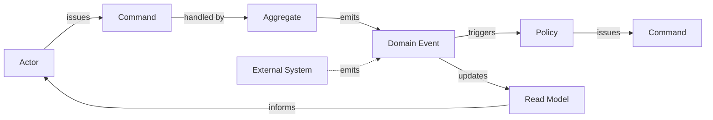

# Event Storming

## Overview
Event Storming is a workshop-based discovery method developed by Alberto Brandolini. A group — typically including domain experts, product, and engineers — maps out the events that occur in a business domain on a long wall using sticky notes. The process surfaces domain knowledge, exposes inconsistencies, and produces input for both [strategic](strategic-design.md) and [tactical](tactical-design.md) design.

It is not a formal modelling notation. Its value comes from the conversation it forces, not the diagram it produces.

## Three levels of detail
Event Storming is usually applied at one of three resolutions, depending on what is being explored.

### Big Picture Event Storming
The goal is to map the entire business process from end to end. Participants place domain events in chronological order across a wide timeline. The output is a shared overview of how the business actually works, not how anyone thinks it does.

**Used for:**
- Understanding a new domain.
- Aligning a cross-functional group on the business flow.
- Identifying candidate [bounded contexts](strategic-design.md).

### Process Level Event Storming
A zoom-in on one part of the big picture. Events are still the backbone, but commands, actors, policies, and external systems are added. The flow of cause and effect becomes visible: what triggers what, where decisions happen, where information is missing.

**Used for:**
- Designing a workflow within a single context.
- Surfacing rules and policies that govern transitions.
- Identifying where the model is unclear.

### Design Level Event Storming
The finest resolution. Aggregates, read models, and ports to other systems are added. The output approaches a tactical design: which aggregates exist, what commands they accept, what events they emit.

**Used for:**
- Driving an implementation directly from the workshop.
- Validating an aggregate boundary against actual business flow.
- Producing concrete artefacts for [tactical design](tactical-design.md).

## Building blocks
Each element is a sticky note of a specific colour. The exact colours vary; the distinctions matter.

| Element | Meaning |
|---|---|
| **Domain Event** | Something that happened in the past. Named in past tense. *OrderPlaced*, *PaymentFailed*. |
| **Command** | A request to do something. Triggers an event when accepted. *PlaceOrder*, *RefundPayment*. |
| **Actor** | A person or role that issues a command. *Customer*, *Warehouse Operator*. |
| **Policy** | A rule that reacts to an event by issuing a command. *Whenever PaymentFailed, then NotifyCustomer*. |
| **Aggregate** | The thing that accepts a command and emits an event. *Order*, *Payment*. |
| **Read Model** | Information shown to an actor to support a decision. *OrderSummary*, *AvailableInventory*. |
| **External System** | A system outside the domain that participates in the flow. *PaymentGateway*, *EmailService*. |
| **Hotspot** | A point of disagreement, ambiguity, or unresolved question. Captured explicitly, not papered over. |

## Topology

The recurring pattern is: an actor (or policy) issues a command; an aggregate accepts it and emits an event; the event updates a read model or triggers another policy. Hotspots attach to wherever the group cannot agree.

## How a session runs
A typical session has rough phases. The order is consistent; the duration depends on scope.

1. **Chaotic exploration.** Participants throw domain events onto the wall in any order. The goal is breadth, not structure.
2. **Enforce timeline.** Events are arranged chronologically. Gaps and duplicates become visible.
3. **Identify pivotal events.** Events that mark important business transitions. These often correspond to candidate context boundaries.
4. **Add commands and actors.** What triggers each event, and who issues the command.
5. **Add policies and external systems.** Reactive rules and the world outside the modelled domain.
6. **Add aggregates** (at process or design level). Which thing accepts the command and emits the event.
7. **Surface hotspots throughout.** Anything unclear, contested, or unknown gets a marker. These drive follow-up work.

The output is the wall itself, captured by photo and transcribed. The diagram is secondary to the shared understanding the participants leave with.

## Why it works
- **Events are concrete.** Asking "what happens" produces more grounded answers than asking "what does the system do".
- **Time is a strong axis.** A timeline of events makes gaps, contradictions, and missing steps visible in a way that boxes-and-arrows diagrams do not.
- **The whole group contributes.** Domain experts and engineers work on the same wall with the same notes, so no one role's view dominates.
- **Hotspots are first-class.** Disagreements are not resolved by the loudest voice; they are captured as work to do.

## Outputs for design
- **Candidate bounded contexts.** Clusters of related events often signal a context boundary.
- **[Ubiquitous language](ubiquitous-language.md).** Event names, command names, and aggregate names become the language the team and code share.
- **Aggregate candidates.** At design level, the boxes that consume commands and emit events.
- **Integration points.** External systems and cross-context events feed the [context map](context-maps.md).

## Common pitfalls
- **No domain experts in the room.** Engineers storming on their own produce a model of their assumptions, not the domain.
- **Drifting into solutions early.** Talking about classes, databases, or APIs before the event flow is clear. Hold the discussion at the domain level until the timeline is settled.
- **Skipping hotspots.** Glossing over disagreements to keep the session moving. The hotspots are often the most valuable output.
- **Treating the wall as the deliverable.** The wall is a record of the conversation. The conversation, and the resulting shared model, is what matters.
- **One mega-session.** Trying to cover an entire domain in one big-picture session, never zooming in. Big picture identifies where to zoom; the zoom is where design happens.
- **Sessions that run too long.** Pushing past the point where the group is still productive. A second shorter session usually yields more than one fatigued long one.
- **Underestimating the people cost.** Setup is cheap; the time of senior domain experts, product, and engineers in the same room is the real cost. Plan the session so that cost actually pays off.
