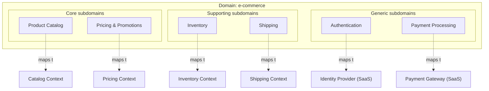

# Strategic Design

## Overview
Strategic design is the part of DDD that decides how a system is divided. It identifies which areas of the business matter most, splits the problem space into manageable pieces, and draws boundaries that the rest of the architecture builds on.

Three concepts carry the strategic level: **domain**, **subdomain**, and **bounded context**. Domain and subdomain describe the problem space (what the business does). Bounded context describes the solution space (how the model is divided in software).

## Domain
The domain is the entire area of business the system addresses. For a logistics company, the domain is logistics. For a hospital, it is healthcare. The domain is rarely modelled as a whole; it is decomposed into smaller parts.

## Subdomains
A subdomain is a part of the domain with its own focus and rules. Subdomains are classified by how strategically important they are to the business.

### Core subdomain
Where the business creates competitive advantage. The most complex and most differentiating part of the domain. Investment here pays off: skilled people, custom models, careful design.

Examples: pricing engine in an airline, matching algorithm in a marketplace, risk model in an insurance company.

### Supporting subdomain
Necessary for the business to function, but not a source of competitive advantage. Custom development is justified because no off-the-shelf solution fits well enough, but the modelling effort should be proportionate.

Examples: an internal scheduling tool, a custom contract management workflow.

### Generic subdomain
A solved problem common to many businesses. Buy, do not build. Use existing libraries, SaaS products, or standards.

Examples: authentication, payment processing, email delivery, accounting.

### Why the classification matters
Each class deserves a different investment. Treating a generic subdomain as if it were core wastes effort; treating a core subdomain as if it were generic gives away the advantage. Strategic design is partly about being honest about which is which.

| Subdomain | Build strategy | Modelling effort | Talent allocation |
|---|---|---|---|
| Core | Custom | High, evolve over time | Best people |
| Supporting | Custom, simple | Moderate | Solid people |
| Generic | Buy or adopt | Minimal | Integrate, do not invent |

## Bounded Context
A bounded context is a boundary inside which a single, consistent model applies. Within it, terms have one meaning, rules are unambiguous, and the model is internally consistent. Outside it, the same word may refer to something else.

A bounded context is a solution-space concept. It is what gets implemented: a module, a service, a codebase.

### Why boundaries are necessary
A single model that tries to cover an entire domain becomes contradictory. A *Customer* in sales is a lead; in billing, an invoice recipient; in support, a ticket owner. Forcing one *Customer* class to serve all three roles produces a bloated model that nobody fully understands.

A bounded context lets each part of the system have its own *Customer* model, shaped by its own needs.

### Subdomain vs. bounded context
The two are related but distinct.

- A **subdomain** is part of the problem (the business reality).
- A **bounded context** is part of the solution (the software model).

The ideal alignment is one bounded context per subdomain. Reality is messier: a single bounded context may cover several small subdomains, or one large subdomain may be split into several contexts. The mapping is a design decision, not a given.

## Topology

The diagram shows the problem space (subdomains) on top and the solution space (bounded contexts) below. Generic subdomains are typically not implemented as in-house bounded contexts but consumed as external services.

## Drawing context boundaries
Useful signals that two things belong in different bounded contexts:

- **Language diverges.** The same word means different things to different people.
- **Lifecycle diverges.** Two concepts change at different rates or are owned by different teams.
- **Rules conflict.** Validation, invariants, or workflows differ between use cases.
- **Data needs diverge.** One side needs a thin reference, the other a rich detail.

Useful signals that two things belong in the same bounded context:

- **Shared invariants.** A rule must hold across both for the model to be correct.
- **Strong transactional needs.** Changes must commit together.
- **Single team ownership.** One team designs, builds, and reasons about both.

## Common pitfalls
- **Single canonical model.** Trying to keep one shared *Customer* or *Order* type across the whole system. The model becomes a lowest common denominator that fits no use case well.
- **Boundaries drawn along technical lines.** Splitting by layer (UI, service, repository) instead of by domain. Produces tight coupling along the wrong axis.
- **Misclassifying subdomains.** Treating a generic subdomain (e.g., billing) as if it were core, and investing custom effort that an off-the-shelf solution would handle. Or the reverse: treating a core subdomain as generic and outsourcing the competitive advantage.
- **One context per team without domain analysis.** Conway's Law in reverse: teams shape boundaries that match the org chart rather than the domain. Sometimes appropriate, often not.
- **Hiding cross-context translation.** Pretending boundaries are free. Each context having its own [ubiquitous language](ubiquitous-language.md) means concepts get translated at the edges; hiding that translation instead of designing it ([Context Maps](context-maps.md)) leads to silent coupling.
- **Treating first-cut boundaries as final.** Locking in initial boundaries before the domain is well understood, then resisting refinement as new knowledge arrives. Boundaries are expected to move; the cost is borne later if they cannot.
