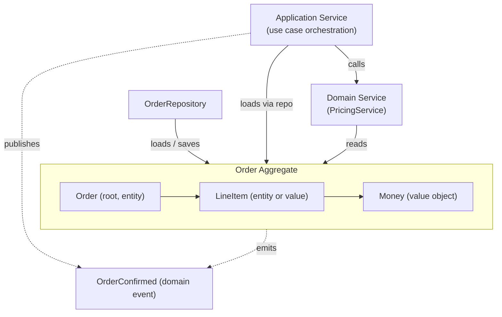

# Tactical Design

## Overview
Tactical design is the part of DDD that shapes the inside of a single [bounded context](strategic-design.md). It is a vocabulary of building blocks — entities, value objects, aggregates, domain events, repositories, domain services, factories — used to express domain rules in code.

The building blocks are not a checklist. They are a set of distinctions that help separate identity from value, transactional rules from queries, and domain logic from infrastructure. Whether a given concept becomes an entity or a value object is itself a modelling decision.

## Value Object
A value object is defined entirely by its attributes. Two value objects with the same attributes are interchangeable. It has no identity of its own, no lifecycle, and is typically immutable.

```python
from dataclasses import dataclass

@dataclass(frozen=True)
class Money:
    amount: int        # in minor units (cents)
    currency: str

    def add(self, other: "Money") -> "Money":
        if self.currency != other.currency:
            raise ValueError("currency mismatch")
        return Money(self.amount + other.amount, self.currency)
```

A `Money(500, "EUR")` is the same as any other `Money(500, "EUR")`. There is no "this particular five-euro instance".

**When to use:** measurements, descriptions, quantities, dates, addresses — anything where the *values* matter and identity does not.

## Entity
An entity has an identity that persists across changes. Two entities with identical attributes are not interchangeable; they are different things if their identities differ.

```python
class Order:
    def __init__(self, order_id: OrderId, customer_id: CustomerId):
        self.id = order_id
        self.customer_id = customer_id
        self.lines: list[LineItem] = []
        self.status = OrderStatus.DRAFT

    def add_line(self, line: LineItem) -> None:
        if self.status != OrderStatus.DRAFT:
            raise InvalidOperation("cannot modify a confirmed order")
        self.lines.append(line)
```

The `Order` is the same `Order` even after its lines change or its status updates. Identity, not attributes, defines it.

**When to use:** things that change state over time and need to be distinguished from one another even when their attributes coincide.

## Aggregate
An aggregate is a cluster of entities and value objects treated as a single unit for the purpose of consistency. It has one **aggregate root** — an entity through which all access to the aggregate's contents passes.

The aggregate enforces invariants that span its contents. The root is responsible for keeping those invariants true.

```python
class Order:                          # aggregate root
    def __init__(self, order_id: OrderId, customer_id: CustomerId):
        self.id = order_id
        self.customer_id = customer_id
        self._lines: list[LineItem] = []
        self.status = OrderStatus.DRAFT

    def add_line(self, product_id: ProductId, quantity: int, unit_price: Money) -> None:
        if self.status != OrderStatus.DRAFT:
            raise InvalidOperation("cannot modify a confirmed order")
        if quantity <= 0:
            raise InvalidOperation("quantity must be positive")
        self._lines.append(LineItem(product_id, quantity, unit_price))

    def total(self) -> Money:
        if not self._lines:
            return Money(0, "EUR")
        return sum((line.subtotal() for line in self._lines[1:]),
                   start=self._lines[0].subtotal())

    def confirm(self) -> None:
        if not self._lines:
            raise InvalidOperation("cannot confirm empty order")
        self.status = OrderStatus.CONFIRMED
```

Code outside the aggregate may not modify `_lines` directly. Every change goes through a method on the root, which checks the invariants.

### Aggregate boundaries
The hardest tactical decision in DDD is where to draw aggregate boundaries. Two competing forces:

- **Large aggregates** can enforce more invariants atomically. They reduce the risk of inconsistent state but make the aggregate slow to load, contention-prone under concurrency, and rigid against change.
- **Small aggregates** load and write faster, scale better, and concur better. They cannot enforce invariants that span their boundaries; those rules become eventually consistent.

Useful heuristics:

- **Invariant-driven.** If a rule must always hold (e.g., "the sum of line items equals the order total"), the elements involved belong in one aggregate.
- **One aggregate per transaction.** A single business operation modifies one aggregate. Rules that span aggregates are handled via [domain events](#domain-event) and eventual consistency.
- **Reference other aggregates by id, not by object.** An `Order` holds a `CustomerId`, not a `Customer`. This keeps aggregates loosely coupled and load boundaries clear.

## Domain Event
A domain event is a record of something that happened in the domain. It is named in the past tense, immutable, and significant to the business.

```python
@dataclass(frozen=True)
class OrderConfirmed:
    order_id: OrderId
    customer_id: CustomerId
    total: Money
    occurred_at: datetime
```

Events are produced by aggregates as a side effect of state changes. Other parts of the system react to them: updating a read model, sending a notification, triggering a workflow in another bounded context.

**Why events matter:**

- They make domain transitions explicit and inspectable.
- They decouple producers from consumers; the aggregate does not know who reacts.
- They are the natural integration mechanism for [event-driven architectures](../architecture-patterns/event-driven.md) and across [bounded contexts](context-maps.md).

## Repository
A repository provides collection-like access to aggregates. It hides whatever persistence mechanism is used (relational database, document store, in-memory) behind a domain-shaped interface.

```python
class OrderRepository(Protocol):
    def get(self, order_id: OrderId) -> Order | None: ...
    def save(self, order: Order) -> None: ...
```

There is one repository per aggregate root. Repositories return aggregates, never partial pieces of them. Queries that do not load a full aggregate (read models, reports) belong elsewhere, often outside the domain layer entirely — see [CQRS](../system-design/cqrs-event-sourcing.md).

**Why a repository instead of direct database access:**

- The domain model does not depend on the persistence technology.
- The model can be tested with an in-memory implementation.
- Loading rules (eager versus lazy, version checks) are centralised.

## Domain Service
A domain service holds domain logic that does not belong on any single entity or value object. It is used when the operation involves several aggregates or expresses a process rather than the state of one object.

```python
class PricingService:
    def __init__(self, tax_calculator: TaxCalculator, promotion_lookup: PromotionLookup):
        self._tax = tax_calculator
        self._promos = promotion_lookup

    def price_order(self, order: Order, customer: Customer) -> Money:
        subtotal = order.total()
        promotions = self._promos.for_customer(customer.id)
        discount = max((p.apply(subtotal) for p in promotions), default=Money(0, "EUR"))
        tax = self._tax.calculate(subtotal.subtract(discount), customer.country)
        return subtotal.subtract(discount).add(tax)
```

Domain services are stateless and named after the domain operation they perform. They are not a dumping ground for "stuff that does not fit anywhere"; that is a sign of a missing model.

### Domain service vs. application service
- A **domain service** contains domain logic — rules from the business.
- An **application service** orchestrates use cases — loading aggregates, calling domain logic, persisting changes. It contains no domain rules itself.

This distinction is often confused. Application services live above the domain; domain services live inside it.

## Factory
A factory encapsulates the construction of complex aggregates. It is used when creating an aggregate involves more than a constructor call — assembling parts, applying defaults, checking initial invariants.

```python
class OrderFactory:
    def __init__(self, id_generator: IdGenerator):
        self._ids = id_generator

    def new_order(self, customer: Customer, items: list[CartItem]) -> Order:
        order = Order(self._ids.next_order_id(), customer.id)
        for item in items:
            order.add_line(item.product_id, item.quantity, item.price)
        return order
```

A factory keeps construction logic out of the aggregate itself, so the aggregate stays focused on its invariants once it exists.

## Putting it together



A typical use case flow: the application service loads an aggregate through its repository, calls a method on the root (which may use a domain service), saves the aggregate back, and publishes any emitted events.

## Common pitfalls
- **Anaemic domain model.** Entities are bags of getters and setters; all behaviour lives in services. The domain is then expressed only in procedural code, defeating the point.
- **God aggregate.** An aggregate that owns too much. Loading it is slow, modifying it is contentious, and invariants pile up.
- **Aggregates sliced too thin.** The opposite mistake: aggregates so small that genuine invariants must be coordinated across them. Eventual consistency where transactional consistency was required.
- **Repository as DAO.** Repositories that expose ad-hoc query methods (`findByXAndY`, `findAllWithStatus`) and return half-loaded objects. The repository becomes a thin wrapper over the database, not a domain abstraction.
- **Primitive obsession.** Using `str`, `int`, and `dict` for concepts that deserve their own value object (`EmailAddress`, `Money`, `OrderId`). Rules then live in validators scattered across the codebase.
- **Domain service catch-all.** Treating domain services as a dumping ground for any logic that does not fit on an entity. Usually a signal that the model is missing a concept.
- **Events that are not events.** Naming things `*Request` or `*Command` and treating them as events. Events describe what *happened*; commands describe what should *happen*.
- **Tactical patterns where they do not fit.** Applying the full set of building blocks to a simple CRUD area. The modelling effort outweighs the benefit, and the code becomes harder to read than the problem requires.
- **Domain events without delivery guarantees.** Publishing events from aggregates without an outbox, retries, or idempotent handlers. Reactions silently miss or duplicate, and the consistency story breaks.
