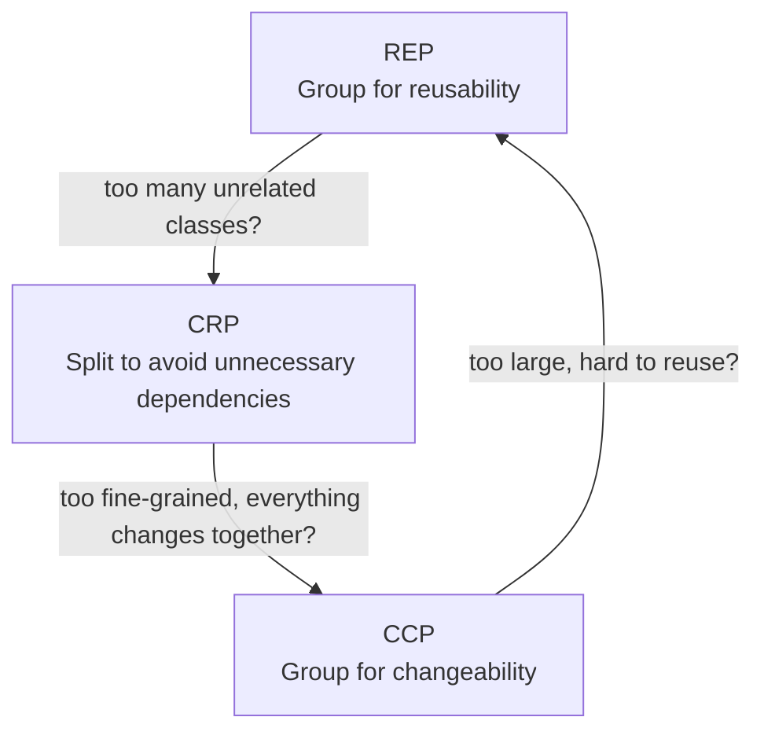
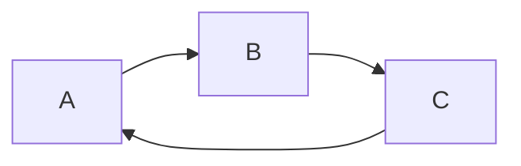
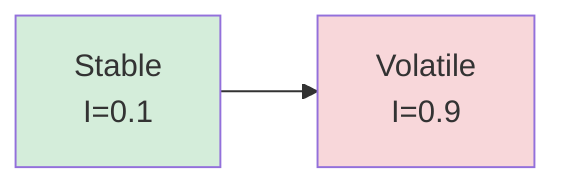
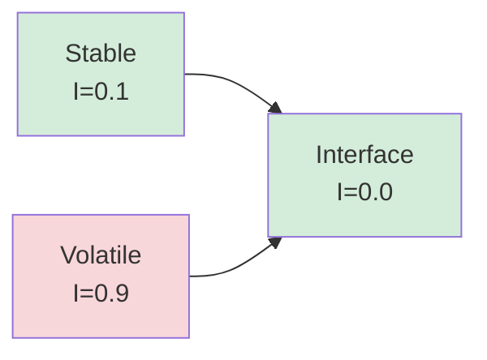

# Component Principles

Component principles describe how to group classes into components and how components should depend on each other. They were formalized by Robert C. Martin and apply at the package, module, or service level; any unit that is versioned and deployed as a whole.

There are two groups: **cohesion principles** (what belongs in a component) and **coupling principles** (how components relate to each other).

---

## Cohesion principles

These three principles answer the question: *which classes belong in the same component?*

### REP: Reuse/Release Equivalence Principle

> The granule of reuse is the granule of release.

Classes that are grouped into a component should be releasable together. If you cannot meaningfully release and version a set of classes as a unit, they do not belong in the same component.

In practice: every class in a component should be relevant to users of that component. If users only need half of what a component provides, the component is too coarse, which violates REP and likely CRP as well.

---

### CCP: Common Closure Principle

> Gather into a component those classes that change for the same reasons at the same times. Separate into different components those classes that change at different times or for different reasons.

CCP is the Single Responsibility Principle applied at the component level. A component should have one reason to change. If a regulatory requirement forces a change, only the compliance component should be affected. If a UI change forces a change, only the presentation component should be affected.

This minimizes the number of components that need to be retested and redeployed for a given type of change.

---

### CRP: Common Reuse Principle

> Don't force users of a component to depend on things they don't need.

If two classes are in the same component but a consumer only needs one of them, that consumer is still forced to track releases of the entire component. CRP says: only group classes that are *always* used together.

CRP is the Interface Segregation Principle applied at the component level.

---

### Tension between cohesion principles

The three cohesion principles pull in different directions:



| Sacrifice | Consequence |
|---|---|
| REP | Too many components change for unrelated reasons |
| CCP | Too many components affected by a single change |
| CRP | Unnecessary redeployments because of unused dependencies |


---

## Coupling principles

These three principles answer the question: *how should components depend on each other?*

### ADP: Acyclic Dependencies Principle

> Allow no cycles in the component dependency graph.

A cycle means two or more components depend on each other, directly or indirectly. This destroys independent deployability: you cannot release component A without first releasing component B, which depends on A.

**Example of a cycle:**



Changing A forces B and C to be considered, which forces A to be considered again. The components can no longer be built or tested in isolation.

**Breaking a cycle:** two strategies:

1. **Invert a dependency** using an interface or abstraction. If C depends on A to get a type, define that type in a separate component that both A and C depend on.
2. **Extract a shared component** that the cyclic components both depend on without depending on each other.

Automated enforcement (e.g. as a fitness function in CI) is the most reliable way to prevent cycles from being reintroduced.

---

### SDP: Stable Dependencies Principle

> Depend in the direction of stability.

**Stability** here does not mean "doesn't change often"; it means *hard to change because many things depend on it*. A component is stable when many others depend on it (high afferent coupling, Ca) and it depends on few others (low efferent coupling, Ce).

Instability is defined as:

```
I = Ce / (Ca + Ce)
```

- `I = 0`: maximally stable (nothing it depends on, everything depends on it)
- `I = 1`: maximally unstable (depends on many, nothing depends on it)

SDP states: **a component should only depend on components with a lower instability value than its own.**

If a volatile component (I ≈ 1) is depended upon by a stable component (I ≈ 0), the stable component becomes hard to maintain; every change to the volatile component threatens the stable one.

**Violation example:**



Stable depends on Volatile. This is a design problem. Introduce an abstraction to invert the dependency.

**Corrected with interface:**



---

### SAP: Stable Abstractions Principle

> A component should be as abstract as it is stable.

Stable components (low I) are depended on by many others. If they contain concrete implementations, they are difficult to extend without modifying, and being modified is risky when many things rely on you. Stability should therefore come from abstraction, not from rigidity.

SAP defines the **Abstractness** of a component:

```
A = Na / Nc
```

Where `Na` is the number of abstract types (interfaces, abstract classes) and `Nc` is the total number of types in the component.

- `A = 1`: fully abstract (only interfaces or abstract classes)
- `A = 0`: fully concrete (no abstractions)

SDP + SAP together imply: **stable components should be abstract; unstable components can be concrete.**

---

### The Main Sequence

Plotting components by instability (I) and abstractness (A) reveals two failure zones:

```
A
1 |  ●  (abstract, stable) ← ideal
  |     \
  |      \  Main Sequence
  |       \
0 |        ●  (concrete, unstable) ← ideal
  +----------→ I
  0          1

Zone of Pain (I≈0, A≈0): stable but concrete, hard to change, hard to extend
Zone of Uselessness (I≈1, A≈1): abstract but unstable, no one depends on it
```

Components close to the **Main Sequence** (`A + I ≈ 1`) are well-designed: stable things are abstract, unstable things are concrete.

**Distance from the Main Sequence:**

```
D = |A + I - 1|
```

`D = 0` is ideal. Use D as a metric in architecture reviews to identify components that have drifted into a zone of pain or uselessness.

---

## Summary

| Principle | Rule |
|---|---|
| **REP** | Release together what is reused together |
| **CCP** | Group what changes together, separate what changes apart |
| **CRP** | Don't force consumers to depend on what they don't use |
| **ADP** | No cycles in the dependency graph |
| **SDP** | Depend in the direction of stability |
| **SAP** | Stable components should be abstract |

---

## Practical guidelines

- Run dependency cycle detection in CI. Cycles are easy to introduce and hard to untangle later.
- Measure instability per component during architecture reviews. A stable component that is concrete (Zone of Pain) is a refactoring candidate.
- When a stable component needs to depend on a volatile one, introduce an interface in a separate stable component and invert the dependency.
- Early in a project, optimize for CCP: keep things together so change is fast. As the codebase grows and teams share components, shift toward CRP to avoid unnecessary coupling.
- The Main Sequence is a diagnostic tool, not a hard target. Use distance from the sequence to start a conversation, not to mandate rewrites.
