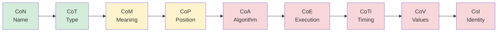
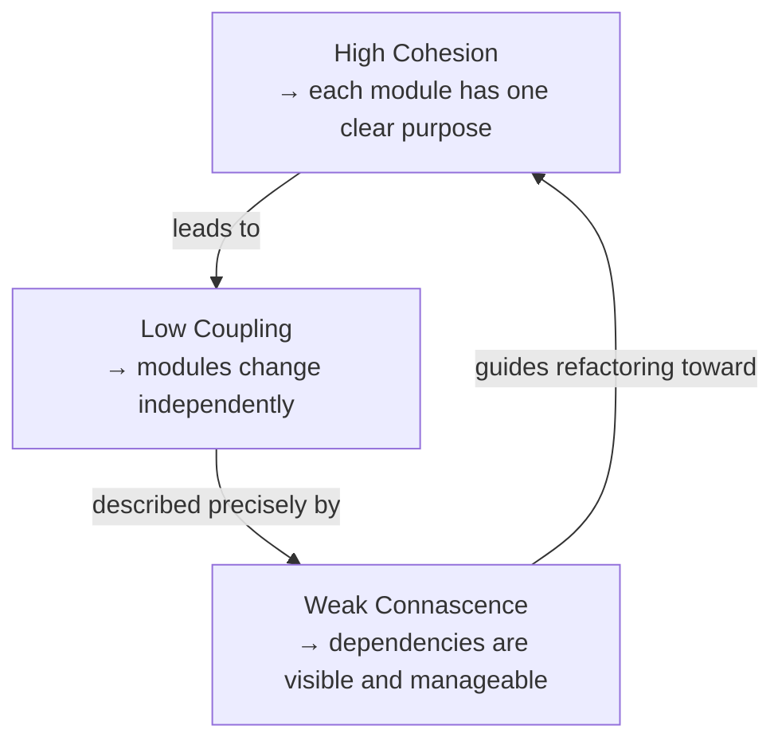

# Modularity

Modularity is the degree to which a system is composed of well-separated, self-contained units. A modular system is easier to understand, change, test, and scale, because changes are contained and dependencies are explicit.

The key concepts that define modularity are **cohesion**, **coupling**, and **connascence**.

---

## Cohesion

Cohesion measures how strongly the elements inside a module belong together. High cohesion means a module has one clear purpose. Low cohesion means a module does many unrelated things.

### Cohesion types (weakest to strongest)

| Type | Description | Example |
|---|---|---|
| Coincidental | Elements grouped arbitrarily | A `Utils` class with unrelated helpers |
| Logical | Elements do similar things but are unrelated | All logging and all email sending in one class |
| Temporal | Elements execute at the same time | Startup initialization routines in one module |
| Procedural | Elements follow a fixed sequence | Steps of a file-processing script |
| Communicational | Elements operate on the same data | Validate, transform, and save the same record |
| Sequential | Output of one element feeds into the next | Parse -> validate -> enrich -> persist |
| Functional | All elements contribute to one single, well-defined task | A `PasswordHasher` that only hashes passwords |

**Aim for functional or sequential cohesion.** Avoid coincidental and logical cohesion, because they are signs that a module is doing too many unrelated things.

---

## Coupling

Coupling measures how much one module depends on another. Low coupling means modules can change independently. High coupling means changing one module forces changes in others.

### Coupling types

| Type | Description | Risk |
|---|---|---|
| Content coupling | Module A directly accesses internals of module B | Highest — any internal change breaks A |
| Common coupling | Modules share global mutable state | High — changes to shared state affect all |
| External coupling | Modules depend on the same external format or protocol | Medium-high — protocol changes affect all |
| Control coupling | Module A passes a flag that controls module B's behavior | Medium — B's logic is driven by A |
| Stamp coupling | Modules share a complex data structure, only use parts of it | Medium — changes to the structure affect both |
| Data coupling | Modules communicate via simple, minimal data (parameters) | Low — only the interface matters |
| Message coupling | Modules communicate only via messages or events | Lowest — no shared knowledge |

### Coupling dimensions

Beyond type, coupling has three dimensions:

- **Afferent coupling (Ca)**: how many modules depend *on* a given module. High Ca = high impact if the module changes.
- **Efferent coupling (Ce)**: how many modules a given module depends *on*. High Ce = sensitive to external changes.
- **Instability** = Ce / (Ca + Ce). A value near 1 means unstable (many outgoing dependencies). A value near 0 means stable (many others depend on it).

Stable modules (low instability) should be abstract and rarely change. Unstable modules (high instability) can change freely because little depends on them.

---

## Connascence

Connascence is a more precise model of coupling. Two components are connascent if a change in one requires a change in the other to keep the system correct.

It was introduced by Meilir Page-Jones and provides a vocabulary for describing *what kind* of dependency exists, not just that one exists.

### Static connascence (detectable at compile time)

| Type | Description | Example |
|---|---|---|
| **CoN** — Name | Both agree on the name of something | A method name used in caller and callee |
| **CoT** — Type | Both agree on the type of something | Passing a `User` object between modules |
| **CoM** — Meaning | Both agree on the meaning of a value | `status = 1` means "active" in both |
| **CoP** — Position | Both agree on the order of values | `createUser(name, email)` — order matters |
| **CoA** — Algorithm | Both must use the same algorithm | Hashing a password the same way on both sides |

### Dynamic connascence (only detectable at runtime)

| Type | Description | Example |
|---|---|---|
| **CoE** — Execution | Both must execute in a specific order | Must call `init()` before `run()` |
| **CoTi** — Timing | Both must execute at the same time | Race condition between two threads |
| **CoV** — Values | Related values must change together | `startDate` and `endDate` must stay consistent |
| **CoI** — Identity | Both must reference the exact same instance | Two components sharing a mutable object |

### Connascence strength

**Weak (green)** -> acceptable. **Strong (red)** -> refactor if possible.

### How to use connascence in practice

1. **Prefer static over dynamic.** Static connascence is visible at compile time and easier to manage.
2. **Prefer weak over strong.** CoN (name) is easy to manage; CoI (shared identity) is a hidden dependency.
3. **Minimize connascence across module boundaries.** Within a module, stronger connascence is acceptable. Across boundaries, aim for CoN or CoT only.
4. **Use named types instead of primitives.** Replace `createUser(string, string, int)` (CoP) with a typed request object (CoT).

---

## How cohesion, coupling, and connascence relate

- High cohesion naturally reduces coupling, a focused module has fewer reasons to touch other modules.
- Low coupling reduces connascence — fewer dependencies mean fewer things that must change together.
- Connascence gives you a vocabulary to *identify* and *prioritize* what to refactor.

---

## Practical guidelines

- Name modules after what they *do*, not what they *contain* (`OrderPlacer`, not `OrderUtils`).
- A module that is hard to test in isolation has high coupling — treat this as a design signal.
- If you cannot describe a module's responsibility in one sentence, it likely has low cohesion.
- Replace positional arguments (CoP) with typed objects or named parameters.
- Replace magic values (CoM) with constants or enums with shared names (CoN).
- If two modules always change together, consider merging them or introducing a shared abstraction.

---

