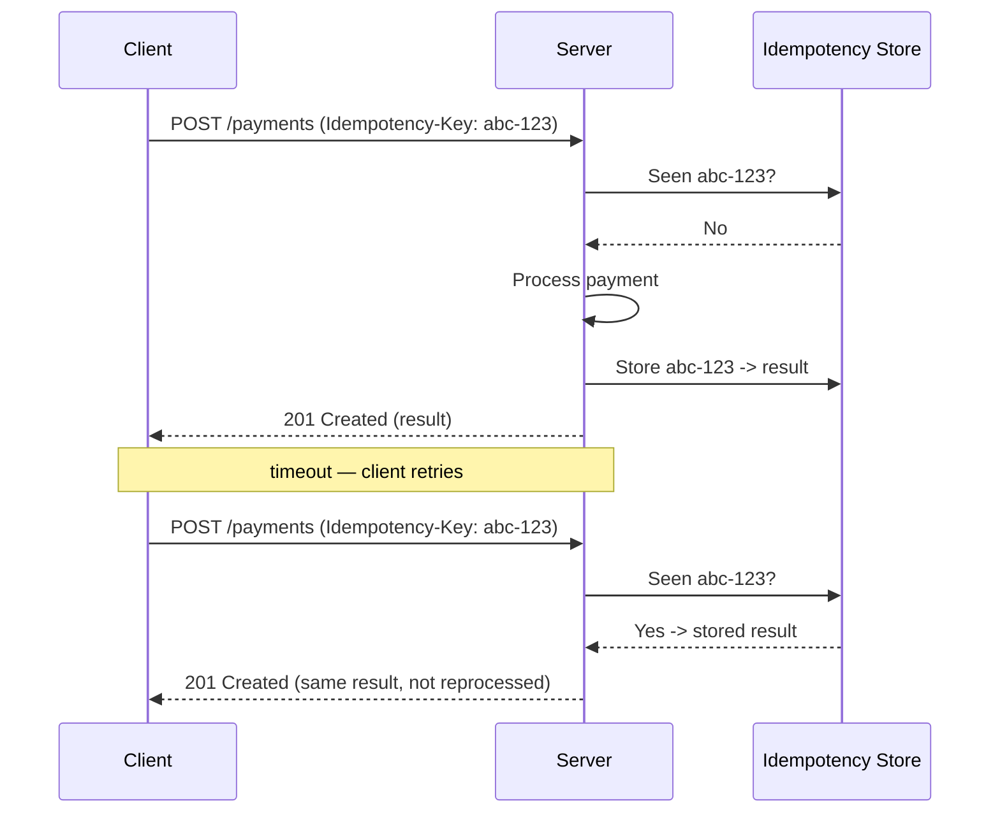

# API Design

## Overview

An API is a contract between a system and its consumers. Once an API is published, consumers couple to its exact shape: every field name, status code, and error format becomes part of the interface they depend on. Changing a published contract is therefore costly in a way that changing internal code is not: internal code can be refactored freely, while a contract change can break consumers the system does not control.

API design is an architectural concern rather than an implementation detail, because the exposed boundary determines how independently a system and its consumers can evolve. An API that hides internal change behind a stable surface allows both sides to change separately; one that exposes implementation details ties the internals to every consumer.

Contracts, versioning, error models, pagination, and idempotency are the design areas that are hardest to change once clients depend on them.

---

## Contracts first

Contract-first design defines the contract (resource shapes, field names, status codes) before the implementation. When the contract is derived from the database schema, every consumer becomes coupled to the storage model, and each schema migration turns into a breaking change. A contract derived from consumer needs keeps storage changes internal.

Two practices support contract stability:

- **Explicit specification.** A machine-readable spec (OpenAPI for REST, Protobuf for gRPC, the schema for GraphQL) acts as the source of truth for documentation, client generation, and contract tests.
- **Minimal exposure.** Each returned field is a field a consumer may depend on. Fields that expose internal identifiers or implementation details widen the contract and constrain future change.

---

## Versioning

A contract change falls into one of two categories:

- **Backward-compatible (non-breaking):** adding an optional field, a new endpoint, or a new optional parameter. Existing clients keep working, so no version bump is required.
- **Breaking:** removing or renaming a field, changing a type, making an optional field required, or changing status-code semantics. These break existing clients and require a versioning strategy.

| Strategy | Example | Trade-off |
|---|---|---|
| URI path | `/v1/orders` | Explicit and easy to route; couples the version to the URL and appears in every path |
| Header / media type | `Accept: application/vnd.api.v2+json` | Keeps URLs stable; harder to discover and test |
| Query parameter | `/orders?version=2` | Simple; mixes versioning with filtering and is easy to omit |

Applying more than one strategy inconsistently across endpoints fragments the contract. Version transitions follow a deprecation lifecycle: the change is announced, both versions run in parallel for a defined window, a sunset date is communicated, and the old version is removed. Without a removal step, each version stays in maintenance indefinitely.

---

## Error models

Errors are part of the contract. Clients write code against error responses, so an inconsistent error format affects them as much as an inconsistent success format. A structured, consistent error body lets clients handle failures programmatically rather than by parsing prose. RFC 9457 (*Problem Details for HTTP APIs*, which obsoletes RFC 7807) defines a standard shape:

```json
{
  "type": "https://api.example.com/errors/insufficient-funds",
  "title": "Insufficient funds",
  "status": 402,
  "detail": "Account balance 12.00 EUR is below the required 50.00 EUR.",
  "instance": "/accounts/12345/transfers/98765"
}
```

Three properties characterise a robust error model:

- **Status codes carry their defined meaning.** `4xx` indicates a client-side problem, `5xx` a server-side one. Returning `200 OK` with an error in the body removes that signal, so clients must inspect the body to determine success or failure.
- **A stable, machine-readable error code** (`type` above) is separate from the human-readable message. Messages change with translations and copy edits; codes remain stable, so clients can branch on the code rather than the message text.
- **Internal details are excluded.** Stack traces, SQL fragments, and internal hostnames in error responses are both a usability and a security concern. See [Confidentiality](../quality-attributes/security/confidentiality.md).

---

## Pagination

A collection that can grow without bound is paginated to keep response sizes predictable. Introducing pagination after release is a breaking change, because a bare-array response becomes a wrapped, paged structure.

| Approach | How it works | Trade-off |
|---|---|---|
| Offset / limit | `?offset=40&limit=20` | Simple, allows jumping to an arbitrary page; rows shift under concurrent inserts and deletes, so items are skipped or duplicated, and large offsets get slower |
| Cursor (keyset) | `?after=<opaque-cursor>` | Stable under concurrent writes, constant performance at any depth; cannot jump to an arbitrary page and requires a stable sort key |

Cursor-based pagination is applied to large or frequently changing datasets, where offset-based pagination skips or duplicates rows under concurrent writes and degrades at large offsets. An opaque cursor that encodes the sort key allows the underlying mechanism to change without affecting consumers.

---

## Idempotency

A request is idempotent if making it more than once has the same effect as making it once. This property allows a client to retry safely after a timeout without knowing whether the original request reached the server.

By HTTP semantics, `GET`, `PUT`, and `DELETE` are defined as idempotent; `POST` is not. Creation is the common problem case: a client sends `POST /payments`, the response is lost to a network failure, and the retry charges the payment twice.

An idempotency key addresses this. The client generates a unique key per logical operation and sends it with the request. The server stores the key together with the result of the first execution and returns that stored result for any later request carrying the same key.



Idempotency at the API boundary is the same problem as at-least-once delivery in messaging: the sender may deliver the same intent more than once, and the receiver collapses the duplicates. See [Event-Driven Architecture](../architecture-patterns/event-driven.md#patterns-commonly-used-with-eda) for the messaging-side counterpart.

---

## Trade-offs

| Decision | Benefit | Cost |
|---|---|---|
| Contract-first (spec before code) | Stable surface, generated clients, contract tests | Upfront design effort before any code runs |
| Versioning from v1 | Room to evolve without breaking clients | Multiple versions to maintain during transitions |
| Standard error format | Clients handle failures uniformly | Requires applying the format on every endpoint |
| Cursor pagination | Stable results, scales to any size | No random page access; opaque cursors to maintain |
| Idempotency keys | Safe retries with no duplicate side effects | Server must store and expire keys |

---

## Common pitfalls

- **Exposing the database schema as the API.** Couples every consumer to the storage model, so any migration becomes a breaking change.
- **`200 OK` with an error in the body.** Defeats standard HTTP error handling and forces defensive body parsing on every client.
- **No pagination on a growing collection.** Works in development, then returns a multi-megabyte payload, or times out, once the table is large in production.
- **Breaking changes without a version bump.** Renaming or removing a field without a new version breaks every client that depended on it, often silently.
- **Unprotected non-idempotent retries.** No idempotency key on creation endpoints means a single network timeout can double-charge, double-book, or double-send.
- **Leaking internals in error responses.** Stack traces and SQL in error bodies are an information-disclosure vulnerability, not only an aesthetic problem.
