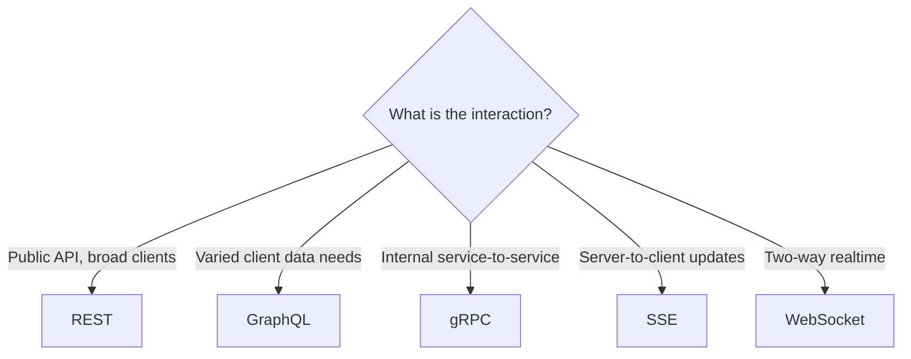

# API Styles

## Overview
An API style is the model and protocol through which a system exposes its capabilities. It is a separate decision from API contract design: versioning, error models, pagination, and idempotency (covered in [API Design](api-design.md)) apply regardless of style. This page compares the common styles and the trade-offs that distinguish them.

---

## Comparison

| Style | Communication model | Transport / encoding | Common fit |
|---|---|---|---|
| **REST** | Request/response over resources | HTTP + JSON | Public APIs, broad client compatibility |
| **GraphQL** | Client-specified queries | HTTP + JSON | Clients with differing data needs |
| **gRPC** | Request/response and streaming | HTTP/2 + Protobuf (binary) | Internal service-to-service calls |
| **WebSocket / SSE** | Persistent connection, push | WebSocket (bidirectional) / SSE (server→client) | Realtime updates |

---

## REST
REST models a system as resources addressed by URLs and manipulated with HTTP methods. It relies on standard HTTP semantics (status codes, caching, content negotiation), which gives it broad tooling and client support. A known limitation is over-fetching and under-fetching: a fixed resource shape often returns more or less than a given client needs, sometimes requiring multiple round trips.

## GraphQL
GraphQL exposes a single endpoint and a schema; clients specify exactly which fields they need in a query. This addresses over- and under-fetching and suits clients with differing data requirements. The trade-offs are that URL-level HTTP caching no longer applies, query cost can be hard to bound (one query may fan out into many resolver calls), and the server must guard against expensive or deeply nested queries.

## gRPC
gRPC is contract-first: a Protobuf schema defines messages and service methods, from which clients and servers are generated. It uses HTTP/2 and a binary encoding, which lowers latency and payload size, and it supports streaming in both directions. It is commonly used for internal service-to-service communication. The trade-offs are limited native browser support and a binary format that is not human-readable without tooling.

## WebSocket and SSE
For data pushed from server to client, two options are common. **WebSocket** opens a persistent, bidirectional connection, suited to interactive two-way exchanges. **Server-Sent Events (SSE)** is a one-way stream from server to client over HTTP, simpler to operate where the client only needs to receive updates. Both differ from the request/response styles above in that the connection stays open.

---

## Trade-offs

| | Pro | Con |
|---|---|---|
| REST | Ubiquitous tooling, HTTP caching, simple model | Over-/under-fetching; many endpoints for complex needs |
| GraphQL | One request for exactly the needed data | Query-cost control and caching are harder |
| gRPC | Low latency, streaming, generated clients | Limited in browsers; binary, not human-readable |
| WebSocket / SSE | Real-time push without polling | Persistent connections add operational state |

---

## When to use / when not to use
- REST fits broad public APIs and resource-oriented operations; it is less suited where clients need widely varying response shapes.
- GraphQL fits many client types reading from one graph of data; it adds cost where data needs are uniform and HTTP caching matters.
- gRPC fits internal, high-throughput service-to-service calls; it is less suited for direct browser consumption.
- WebSocket and SSE fit realtime delivery; they add little where periodic polling already meets the requirement.

When communication does not need an immediate response, asynchronous [Messaging](messaging.md) is an alternative to all of the above.

---

## Common pitfalls
- **REST that ignores HTTP semantics**: using only `POST` and `200` discards the caching, status, and method conventions that make REST interoperable.
- **GraphQL without query-cost limits**: unbounded query depth and breadth expose the server to expensive requests; depth limits and cost analysis are needed.
- **gRPC exposed directly to browsers**: without a gateway or translation layer, browser clients cannot consume it natively.
- **WebSocket where SSE or polling suffices**: a bidirectional, stateful connection adds operational overhead that one-way updates do not require.
