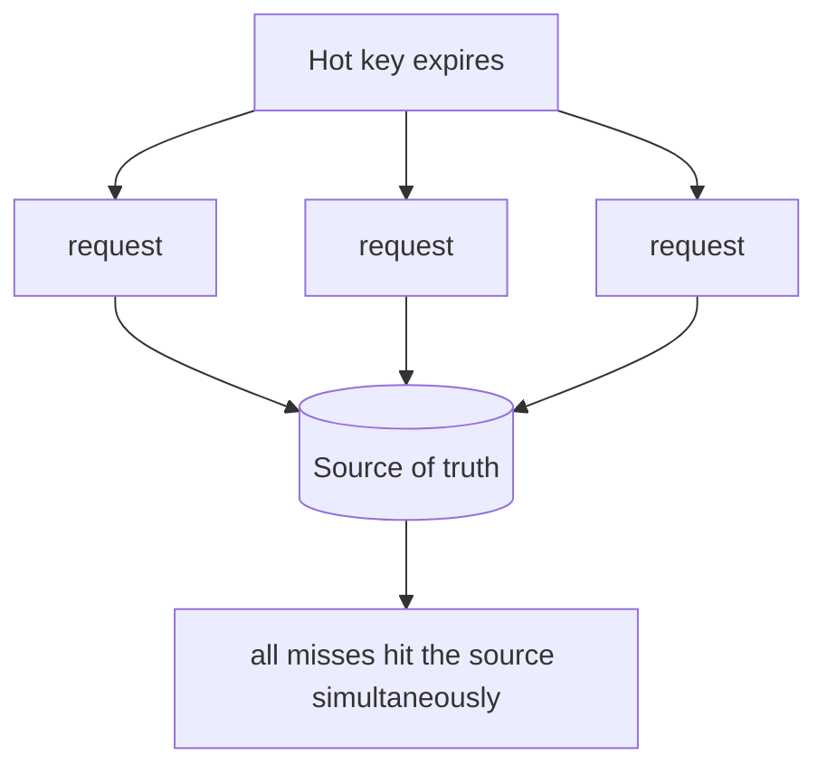

# Caching

## Overview

A cache stores a copy of data in a faster medium or closer to where it is used, so that repeat reads avoid the cost of recomputing or refetching from the source of truth. Caching trades freshness and memory for latency and load: the cached copy can be staler than the source and it consumes memory, in exchange for faster reads and fewer requests to the backing store.

A cache is a second copy of data, so it raises the same problem as any replica — the copy and the source can disagree. Most of the difficulty in caching is keeping that disagreement within acceptable bounds. See [Consistency Models](consistency-models.md).

---

## Caching strategies

The strategy defines who reads and writes the cache and the source, and when.

| Strategy | Read path | Write path | Note |
|---|---|---|---|
| Cache-aside (lazy) | App checks cache; on a miss, reads the source and populates the cache | App writes the source and invalidates or updates the cache | Most common; the cache holds only requested data |
| Read-through | The cache loads from the source on a miss itself | — | Read logic centralised in the cache layer |
| Write-through | — | App writes the cache, which writes the source synchronously | Cache stays fresh; write latency includes both writes |
| Write-behind | — | App writes the cache, which writes the source asynchronously | Fast writes; risk of loss if the cache fails before flushing |

Cache-aside read path in Python:

```python
def get_user(user_id):
    cached = cache.get(user_id)
    if cached is not None:
        return cached                  # hit
    user = db.fetch_user(user_id)      # miss → load from the source of truth
    cache.set(user_id, user, ttl=300)
    return user
```

---

## Expiry and invalidation

A cached entry is removed or refreshed in one of two ways:

- **TTL (time to live):** the entry expires after a fixed time. It needs no coordination with writes and bounds staleness to the TTL; the cost is staleness up to the TTL and a refetch on every expiry.
- **Explicit invalidation:** a write to the source removes or updates the cached entry. It keeps the cache fresh, but the write path must know every cache key affected — a missed key serves stale data indefinitely.

These name the two hard problems directly: invalidation is hard because the writer must locate every dependent key, and eviction under memory pressure (LRU, LFU) can remove entries the system still needs.

---

## Stampede

When a popular entry expires, every concurrent request misses at once and hits the source at the same time, which can overload it — a cache stampede (or thundering herd).



Mitigations:

- **Single-flight / locking:** the first request recomputes the value while others wait for its result, so the source is hit once per key.
- **Early refresh:** refresh an entry shortly before it expires, so it never expires under live traffic.
- **Jittered TTLs:** spread expiry times across keys so many do not expire together.

---

## Key trade-offs

| Decision | Benefit | Cost |
|---|---|---|
| Caching at all | Lower latency, less load on the source | Stale reads; memory use; added complexity |
| Cache-aside | Caches only what is used; survives cache loss | First read per key is a miss; the app handles invalidation |
| Write-through | Cache stays fresh on every write | Higher write latency |
| TTL expiry | No invalidation logic | Staleness up to the TTL |
| Explicit invalidation | Fresher than TTL | The writer must track every affected key |

---

## Common pitfalls

- **No invalidation strategy.** A cache with no plan for writes serves stale data indefinitely.
- **Uniform TTLs on hot keys.** Synchronised expiry causes stampedes against the source.
- **Stacked caches without clear ownership.** Caches at the client, CDN, application, and database layers make stale data hard to trace and clear.
- **Caching data that must be current.** Balances, permissions, and inventory cached without tight invalidation lead to incorrect decisions.
- **No eviction policy.** An unbounded cache becomes a memory leak.
