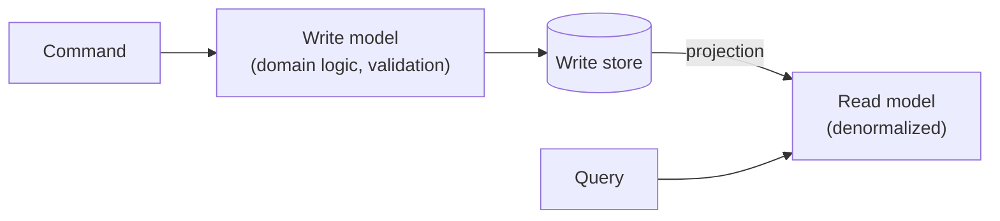
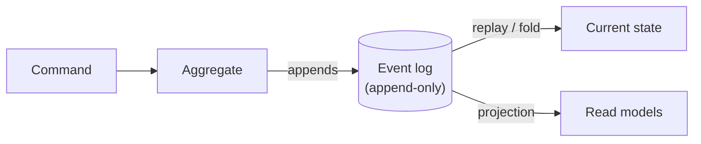

# CQRS and Event Sourcing

## Overview
CQRS (Command Query Responsibility Segregation) and Event Sourcing are two distinct patterns that are frequently used together. CQRS separates the model that changes state from the model that reads it. Event Sourcing stores state as a sequence of events rather than as current values. Either can be used without the other; they are paired because event sourcing produces a natural way to build the read models CQRS relies on.

---

## CQRS
In a CRUD model, one model handles both reads and writes. CQRS splits these into a **command side**, which validates and applies state changes through domain logic, and a **query side**, which serves reads from models shaped for querying.

The read model is derived from the write model, often denormalised for the specific shapes a client queries. The two are usually kept in sync asynchronously, which means a read may briefly lag a write: an explicit case of eventual consistency (see [Consistency Models](consistency-models.md)).

CQRS is applied where read and write workloads differ enough to justify separate models, for example when reads and writes scale independently (see [Capacity](../quality-attributes/performance-efficiency/capacity.md)), or when read shapes are complex enough that one model cannot serve both well.

---

## Event Sourcing
Event Sourcing persists every change as an immutable event in an append-only log. Current state is derived by replaying the events in order, rather than being stored directly.

Because the log retains the full history, it provides a complete audit trail, the ability to reconstruct state at any past point, and the ability to build new read models by replaying existing events. The costs are that events form a contract that must be **versioned** as the system evolves, that replaying a long history is expensive (addressed with periodic **snapshots**), and that derived state is eventually consistent with the log (see [Recoverability](../quality-attributes/reliability/recoverability.md) for the related recovery properties).

---

## Why they pair
Event sourcing emits a stream of events as state changes; CQRS needs a mechanism to keep its read models current. Projecting the event stream into read models connects the two: the write side appends events, and projections build the query side from them. This is the same projection mechanism described in [Event-Driven Architecture](../architecture-patterns/event-driven.md#patterns-commonly-used-with-eda).

---

## Trade-offs

| | Pro | Con |
|---|---|---|
| CQRS | Read and write models scale and evolve independently | Two models to maintain; eventual consistency between them |
| Event Sourcing | Full history, audit trail, rebuildable read models | Event versioning, snapshotting, and replay complexity |
| The pairing | Projections keep read models current from the event log | Combined operational and conceptual overhead |

---

## When to use / when not to use
- CQRS fits where read and write workloads differ in scale or shape enough to justify separate models; it adds overhead where a single model serves both adequately.
- Event Sourcing fits where audit history, temporal queries, or rebuildable projections are requirements; it adds overhead where current-state storage is sufficient.
- Applying either pattern uniformly across a system is uncommon; both are typically applied to the parts of a domain whose requirements justify them.

---

## Common pitfalls
- **CQRS without a driving need**: separating models that have no diverging requirements adds maintenance and consistency overhead without benefit.
- **Ignoring eventual consistency in the UI**: if a read can lag a write, an interface that assumes read-your-writes will show stale data.
- **Event sourcing every aggregate**: the pattern fits aggregates with real audit or history needs, not every entity in the system.
- **No snapshots**: rebuilding state from a long event log on every load becomes slow without periodic snapshots.
- **Mutable or unversioned events**: changing the meaning of past events, or failing to version their schema, breaks replay and projections.
