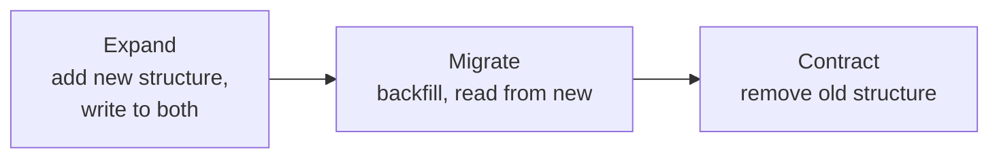

# Data Architecture

## Overview

Data architecture covers how a system stores, structures, and accesses its persistent state. These are among the most durable decisions in a system: storage engines, data models, and schemas are expensive to change once data has accumulated and code depends on their shape. The data tier is also typically the hardest to scale, because state cannot be replicated and moved as freely as stateless compute.

---

## Relational vs non-relational stores

A relational (SQL) database stores data as tables with a fixed schema and supports joins, ACID transactions, and declarative queries. *Non-relational* (NoSQL) is an umbrella for several models, each optimised for a different access pattern.

| Model | Structure | Suited to | Examples |
|---|---|---|---|
| Relational | Tables, fixed schema, joins | Related data, complex queries, strong consistency | PostgreSQL, MySQL |
| Document | Self-contained documents (JSON) | Aggregates read and written as a whole | MongoDB |
| Key-value | Opaque value addressed by key | High-throughput lookups by key | Redis, DynamoDB |
| Wide-column | Rows with dynamic columns | Large-scale writes, time series | Cassandra |
| Graph | Nodes and edges | Relationship-heavy traversal | Neo4j |

A relational store enforces structure and relationships inside the database. A non-relational store moves that responsibility into the application in exchange for a data model that matches a specific access pattern or scales horizontally more readily. Systems that use more than one store for different workloads practise *polyglot persistence*.

---

## Schema evolution

A schema changes over the life of a system. How a change is rolled out determines whether it is safe during a deployment where old and new code run at the same time.

- **Additive changes** (a new optional column, a new table) are backward-compatible: old code ignores what it does not read.
- **Destructive changes** (dropping or renaming a column, narrowing a type) break code that still expects the old shape.

The expand–contract (parallel change) pattern rolls out a breaking change in backward-compatible steps:



1. **Expand:** add the new structure alongside the old; write to both.
2. **Migrate:** backfill existing rows; switch reads to the new structure.
3. **Contract:** once nothing reads the old structure, remove it.

Each step stays compatible with the code running before and after it. This is the storage-side counterpart to the backward-compatible/breaking distinction in [API Design](api-design.md#versioning).

---

## Indexing

An index is a secondary data structure that speeds up reads matching a query, at the cost of extra storage and slower writes, because the index is updated on every insert, update, or delete.

```sql
-- Without an index, this scans every row.
SELECT * FROM orders WHERE customer_id = 42;

-- An index on customer_id turns the scan into a lookup.
CREATE INDEX idx_orders_customer ON orders (customer_id);
```

- An index helps queries that filter or sort on the indexed columns and does nothing for queries on other columns.
- A composite index on `(a, b)` supports queries on `a` and on `(a, b)`, but not on `b` alone, by the leftmost-prefix rule.
- Each index adds write cost and storage. An index that no query uses is pure overhead.

---

## Replication

Replication keeps copies of data on more than one node. It serves two goals: availability (a replica takes over if the primary fails) and read scalability, by spreading reads across replicas.

| Model | How it works | Trade-off |
|---|---|---|
| Single-leader | One node accepts writes and replicates to followers | Simple, no write conflicts; the leader is a write bottleneck and a failover point |
| Multi-leader | Several nodes accept writes and replicate to each other | Writes survive a node loss; write conflicts must be resolved |
| Leaderless | Any replica accepts reads and writes, quorums reconcile | High availability; the application handles consistency (quorums, read-repair) |

Replication is asynchronous by default, so followers lag behind the leader. A read served by a lagging follower can return stale data, an instance of eventual consistency, see [Consistency Models](consistency-models.md). Replication copies the whole dataset to each node; splitting the dataset across nodes for scale is *sharding*, covered in [Scalability](scalability.md#sharding-partitioning).

---

## Trade-offs

| Decision | Benefit | Cost |
|---|---|---|
| Relational store | ACID transactions, joins, schema enforcement | Vertical scaling limits; migrations needed for schema change |
| Non-relational store | Access-pattern fit, horizontal scaling | Consistency and joins move into the application |
| More indexes | Faster reads | Slower writes, more storage |
| Read replicas | Read throughput and a failover target | Replication lag produces stale reads |

---

## Common pitfalls

- **Choosing a store by popularity rather than access pattern.** A store whose data model does not fit the dominant query pattern forces workarounds in the application.
- **Breaking schema migrations deployed in one step.** A drop-and-deploy migration fails when old code is still running during the rollout; expand–contract avoids the gap.
- **Indexing every column.** Each index slows writes and consumes storage; unused indexes add only cost.
- **Treating read replicas as strongly consistent.** A read from a replica immediately after a write can return stale data because of replication lag.
- **Unbounded tables with no archival or partitioning plan.** Tables that only grow eventually degrade query and migration performance.
