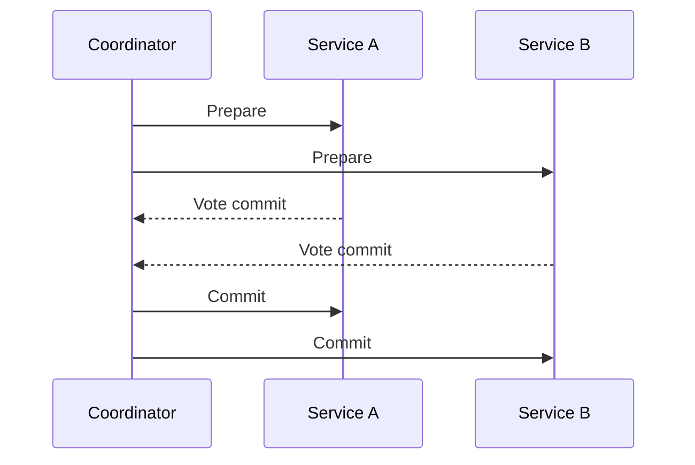
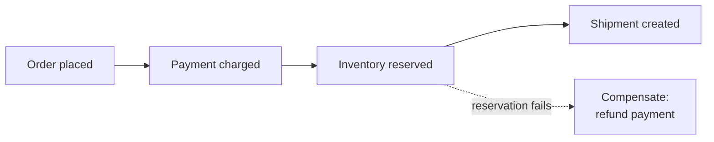

# Distributed Transactions

## Overview

A local transaction gives ACID guarantees within one database: a set of operations either all commit or all roll back. When an operation spans multiple services or databases, each with its own store, there is no shared transaction to enforce all-or-nothing. Distributed transactions are the techniques for keeping data consistent across these boundaries, trading the simplicity of local ACID for the realities of network failure and partial completion.

This problem is a direct consequence of splitting data ownership across services; see [Microservices](../architecture-patterns/microservices.md) and [Event-Driven Architecture](../architecture-patterns/event-driven.md).

---

## Two-phase commit (2PC)

Two-phase commit coordinates a transaction across participants through a coordinator, in two phases.



1. **Prepare:** the coordinator asks every participant to prepare and lock the change.
2. **Commit:** if all vote yes, the coordinator tells everyone to commit; if any votes no, everyone rolls back.

2PC provides strong consistency but blocks: participants hold locks until the coordinator decides, and if the coordinator fails after the prepare phase, participants are left holding locks, the blocking problem. This coupling and locking make 2PC ill-suited to independently deployed services communicating over unreliable networks.

---

## Saga

A saga models a distributed transaction as a sequence of local transactions, one per service. Each step commits locally and emits an event or sends a command that triggers the next step. There is no global lock, and consistency is eventual; see [Consistency Models](consistency-models.md).

When a step fails, earlier steps are undone by **compensating actions**: operations that semantically reverse a completed step. A refund compensates a charge. There is no rollback once a local transaction has committed, only a new transaction that reverses its effect.



Sagas are coordinated in one of two styles:

| Style | Coordination | Trade-off |
|---|---|---|
| Choreography | Each service reacts to events and emits the next | No central component; the flow is implicit and harder to trace |
| Orchestration | A central orchestrator drives each step | The flow is explicit and auditable; the orchestrator is another component |

---

## Outbox pattern

A service that must update its database and publish an event faces a *dual-write* problem: the database and the message broker are two separate systems, and a crash between the two writes leaves them out of sync: the event is lost, or it is published for a change that rolled back.

The outbox pattern makes the two atomic. The event is written to an outbox table in the same local transaction as the data change. A separate relay process reads the outbox and publishes the events, retrying until each is delivered: at-least-once, so consumers must be idempotent (see [Messaging](messaging.md#delivery-guarantees)).

```python
# One local transaction commits the domain change and the event together.
def place_order(order):
    with db.transaction():
        db.insert_order(order)
        db.insert_outbox(event="OrderPlaced", payload=order.id)
    # A separate relay polls the outbox table and publishes to the broker.
```

---

## Trade-offs

| Approach | Consistency | Cost |
|---|---|---|
| 2PC | Strong: atomic across participants | Blocking locks; coordinator is a failure point; poor fit across services |
| Saga | Eventual | A compensating action for every step; intermediate states are visible |
| Outbox | Reliable event publishing, atomic with the write | An extra table and relay process; at-least-once delivery |

---

## Common pitfalls

- **Reaching for 2PC across microservices.** The locking and coordinator coupling negate service independence and degrade under network failure.
- **Sagas without compensating actions.** A failure mid-saga leaves the system in a permanently inconsistent state.
- **Dual writes to a database and a broker.** Without the outbox pattern, a crash between the two writes loses events or publishes phantom ones.
- **Ignoring intermediate states.** A saga is observable mid-flight; reads and the UI must tolerate an order that is paid but not yet shipped.
- **Assuming compensation fully reverses an effect.** Some actions, such as a sent email or a shipped package, cannot be undone, only mitigated.
