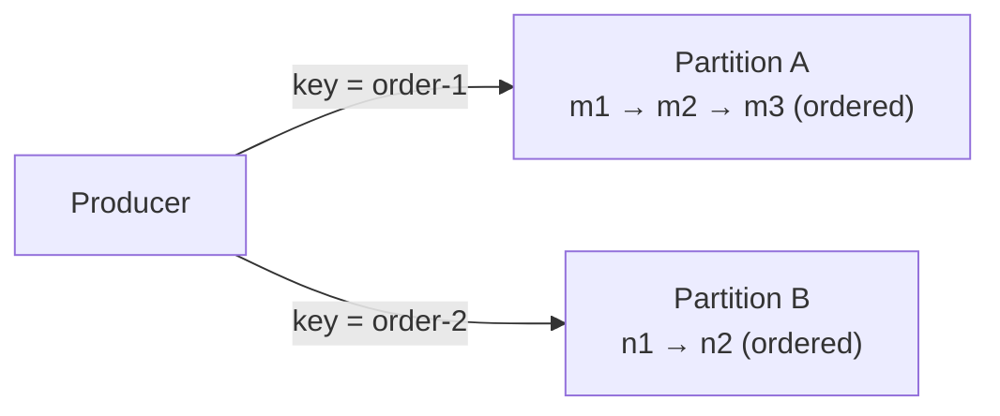

# Messaging

## Overview

Messaging moves data between components asynchronously: a sender hands a message to an intermediary, and a receiver processes it later. This decouples sender and receiver in time (the receiver need not be available when the message is sent) and is the transport that event-driven systems are built on.

This page covers the transport mechanics: how messages are held, ordered, and delivered. For the architectural style built on top of messaging, see [Event-Driven Architecture](../architecture-patterns/event-driven.md).

---

## Queues vs streams

Two models dominate, and they differ in what happens to a message after it is consumed.

| | Queue | Stream / log |
|---|---|---|
| Consumption | A message is removed once a consumer acknowledges it | Messages are retained; each consumer tracks its own position (offset) |
| Consumers | Each message goes to one consumer in a group (competing consumers) | Many independent consumers read the same messages at their own pace |
| Replay | Not possible once a message is consumed | Possible by resetting the offset |
| Examples | RabbitMQ, Amazon SQS | Apache Kafka, Amazon Kinesis |

A queue fits work distribution: many workers share a backlog of tasks, each task handled once. A log fits broadcast and replay: multiple consumers derive independent state from the same ordered sequence of events.

---

## Ordering

Total ordering across all messages is expensive and limits parallelism, because it forces a single sequential path. Most systems instead offer ordering within a partition, or per key: messages sharing a key (for example the same `orderId`) are delivered in the order they were sent, while unrelated keys proceed in parallel.



A partition key that matches the unit of ordering the domain requires, per order or per account, preserves the order that matters while letting different keys scale out across partitions.

---

## Delivery guarantees

No transport can guarantee exactly-once *delivery* end to end, because the sender cannot distinguish a lost message from a lost acknowledgement and must choose whether to retry. Three semantics result:

| Guarantee | Behaviour | Consequence |
|---|---|---|
| At-most-once | Deliver, do not retry | Messages can be lost |
| At-least-once | Retry until acknowledged | Messages can be duplicated |
| Exactly-once (effective) | At-least-once delivery plus idempotent processing | No duplicate *effects*, achieved in the application |

At-least-once is the common default. "Exactly-once" in practice means at-least-once delivery combined with an idempotent consumer that discards duplicates: the same problem as [idempotency at the API boundary](api-design.md#idempotency).

```python
# Idempotent consumer: dedupe by message id, so re-delivery has no extra effect.
def handle(message):
    if processed_ids.contains(message.id):
        return                      # already handled; at-least-once re-delivered it
    apply(message)
    processed_ids.add(message.id)
```

---

## Failure handling

A message that cannot be processed, because it is malformed or its downstream dependency is unavailable, blocks the consumer if it is retried forever. A dead-letter queue (DLQ) holds messages that exceed a retry limit, so the rest of the stream proceeds while the failures are inspected and replayed separately. See [Event-Driven Architecture](../architecture-patterns/event-driven.md#patterns-commonly-used-with-eda) for the DLQ and outbox patterns in the context of producing events reliably.

---

## Trade-offs

| Decision | Benefit | Cost |
|---|---|---|
| Queue (competing consumers) | Simple work distribution, automatic load spread | No replay; each message consumed once |
| Stream / log | Replay and multiple independent consumers | Consumers track offsets; retained data costs storage |
| Per-key ordering | Order where it matters, parallelism elsewhere | The key fixes the unit of parallelism |
| At-least-once + idempotency | No lost or double-applied messages | The consumer must deduplicate |

---

## Common pitfalls

- **Assuming the broker delivers exactly once.** Duplicates still arrive; the consumer has to be idempotent.
- **Requiring global ordering.** It forces single-threaded processing and removes the throughput benefit of messaging.
- **No dead-letter queue.** A single poison message stalls the consumer or is dropped without a trace.
- **Oversized payloads.** Carrying full entity state bloats the transport; a reference plus a follow-up fetch (the claim-check pattern) keeps messages small.
