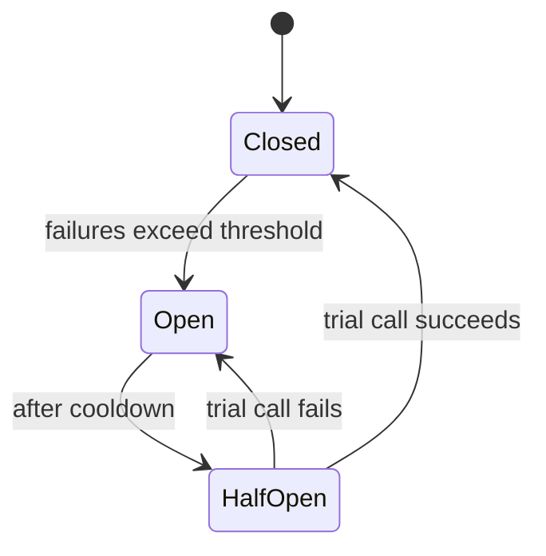

# Resilience

## Overview
In a distributed system, dependencies fail: networks drop packets, services slow down, and downstream systems become unavailable. Resilience patterns contain such failures so that one slow or failing dependency does not cascade into a system-wide outage. Where [Fault Tolerance](../quality-attributes/reliability/fault-tolerance.md) describes the quality attribute, this page describes the patterns commonly used to achieve it at the boundary between a caller and its dependencies.

---

## Patterns

| Pattern | Problem it addresses | Mechanism |
|---|---|---|
| **Timeout** | A call that never returns ties up resources | Bound the wait; fail once a limit is exceeded |
| **Retry with backoff** | Transient failures (brief network or load issues) | Re-attempt with increasing delay and jitter |
| **Circuit breaker** | Repeated calls to a failing dependency | Stop calling after a failure threshold; recover gradually |
| **Bulkhead** | One overloaded dependency exhausts shared resources | Isolate resources per dependency so failures stay contained |
| **Rate limiting / throttling** | More requests than a system can serve | Reject or delay excess load to protect capacity |
| **Backpressure** | A fast producer overwhelms a slow consumer | Signal upstream to slow down rather than buffer without bound |
| **Graceful degradation** | A dependency is unavailable | Serve a reduced result (cached, default, partial) instead of failing |
| **Idempotency** | Retries may duplicate an operation | Make a repeated request safe to apply once |

---

## Timeouts and retries
A timeout bounds how long a caller waits before treating a call as failed, freeing resources for other work. Retries re-attempt a failed call on the assumption that the failure was transient. Retries commonly use **exponential backoff** — increasing the delay between attempts — and **jitter** — randomising the delay — so that many clients do not retry in synchronised waves.

Retries are safe only when the operation is **idempotent**: applying it more than once has the same effect as applying it once (see [API Design](api-design.md#idempotency) and [Messaging](messaging.md#delivery-guarantees)). Retrying a non-idempotent operation can duplicate side effects such as a payment.

```python
import random
import time


def call_with_retry(operation, max_attempts=4, base_delay=0.5):
    for attempt in range(max_attempts):
        try:
            return operation()
        except TransientError:
            if attempt == max_attempts - 1:
                raise
            delay = base_delay * (2 ** attempt)        # exponential backoff
            time.sleep(delay + random.uniform(0, base_delay))  # plus jitter
```

---

## Circuit breaker
A circuit breaker tracks failures to a dependency and stops calling it once a threshold is crossed, so a failing dependency is not flooded with requests that are likely to fail. It moves through three states:



- **Closed**: calls pass through; failures are counted.
- **Open**: calls fail fast without reaching the dependency, giving it time to recover.
- **Half-open**: a limited number of trial calls test whether the dependency has recovered.

A circuit breaker is paired with a fallback: while the circuit is open, the caller needs a defined behaviour — a cached value, a default, or a clear error.

---

## Isolation and load management
- **Bulkhead**: resources such as connection or thread pools are partitioned per dependency, so one saturated dependency cannot consume all capacity — analogous to compartments in a ship's hull.
- **Rate limiting**: a ceiling on accepted requests protects a system from more load than it can serve; excess is rejected (often with HTTP `429`) or delayed.
- **Backpressure**: when a consumer cannot keep up, it signals the producer to slow down rather than buffering without bound; unbounded buffers turn an overload into memory exhaustion.

---

## How patterns combine
These patterns are layered rather than used in isolation. A typical outbound call wraps the dependency in a timeout, retries transient failures with backoff, and trips a circuit breaker if failures persist; a bulkhead isolates its resources, and a fallback provides graceful degradation while the circuit is open.

---

## Decision considerations / trade-offs

| | Pro | Con |
|---|---|---|
| Retries | Recover from transient failures automatically | Amplify load if unbounded; require idempotency |
| Circuit breaker | Prevents hammering a failing dependency | Needs tuning; a fallback must be defined |
| Bulkhead | Contains failures to one dependency | More pools to size and monitor |
| Rate limiting | Protects capacity under load | Rejected requests need handling upstream |
| Graceful degradation | Keeps core function available | Reduced result may be stale or partial |

---

## Common pitfalls
- **Retries without backoff**: synchronised, immediate retries from many clients create a retry storm that worsens the original overload.
- **Retries without idempotency**: re-attempting a non-idempotent operation duplicates side effects.
- **Timeouts longer than the caller's patience**: a downstream timeout that exceeds the upstream one wastes resources on a result no one is waiting for.
- **Circuit breaker without a fallback**: failing fast with no defined alternative converts one failure mode into another.
- **Unbounded queues**: buffering without backpressure delays failure until memory is exhausted, turning a slowdown into a crash.
