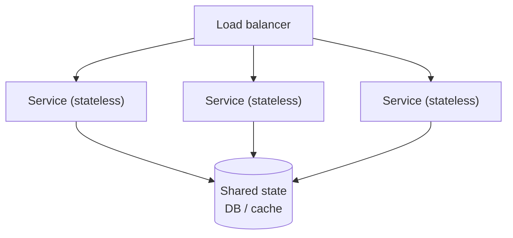

# Scalability

## Overview

Scalability is the ability of a system to handle increased load by adding resources. A scalable system absorbs growth by adding capacity; an unscalable one reaches a ceiling that more hardware cannot raise. Load takes several forms (request rate, data volume, concurrent users), and a system can scale for one while remaining bound on another.

Scalability is closely related to the capacity quality attribute; see [Capacity](../quality-attributes/performance-efficiency/capacity.md).

---

## Vertical vs horizontal scaling

| | Vertical (scale up) | Horizontal (scale out) |
|---|---|---|
| Method | A bigger machine: more CPU, RAM | More machines |
| Limit | The hardware ceiling of one node | No hard ceiling; coordination cost grows |
| Failure | A single point of failure | Redundancy across nodes |
| Complexity | Low: no distribution | Higher: distribution, balancing, consistency |

Vertical scaling is bounded by the largest available machine and keeps a single point of failure. Horizontal scaling removes that ceiling and adds redundancy, at the cost of the coordination problems distribution introduces: load balancing, shared state, and consistency.

---

## Statelessness

Whether a service scales horizontally depends on where it keeps state. A *stateless* service holds no client-specific state between requests, so any instance can serve any request and instances can be added, removed, or replaced freely. A *stateful* service ties a client to a specific instance (for example an in-memory session), which prevents free distribution.

The common pattern is to externalise state: move sessions, caches, and data to a shared store so the service tier stays stateless. State then concentrates in the data tier, which is scaled with replication and sharding.

---

## Load balancing

A load balancer distributes incoming requests across instances, removes failed instances from rotation through health checks, and presents horizontal capacity behind a single endpoint.

- Distribution algorithms include round-robin, least-connections, and hashing on a request key.
- Sticky sessions (routing a client to the same instance) reintroduce statefulness into the service tier and limit even distribution, which removes part of the benefit of horizontal scaling.

---

## Sharding (partitioning)

Replication copies the whole dataset to each node (see [Data Architecture](data-architecture.md#replication)); sharding splits the dataset across nodes so each holds a subset. Sharding is how the data tier scales writes and storage beyond a single machine.

| Approach | How it works | Risk |
|---|---|---|
| Hash-based | Hash the shard key to pick a node | Even spread; range queries touch every shard |
| Range-based | Contiguous key ranges per node | Range queries stay local; sequential keys create hotspots |
| Directory-based | A lookup table maps key to node | Flexible; the lookup is another component to maintain |

A shard key that spreads load evenly and keeps related data together avoids hotspots; a low-cardinality or sequential key concentrates load on one shard. Queries and transactions that span shards are expensive because they touch multiple nodes; see [Distributed Transactions](distributed-transactions.md).

---

## Trade-offs

| Decision | Benefit | Cost |
|---|---|---|
| Vertical scaling | Simple, no distribution | Hardware ceiling; single point of failure |
| Horizontal scaling | No ceiling, redundancy | Distribution complexity |
| Stateless services | Any instance serves any request | State must live in a shared tier |
| Sharding | Scales writes and storage beyond one node | Cross-shard operations are costly; rebalancing is hard |

---

## Common pitfalls

- **Stateful services behind a load balancer.** In-memory sessions break when a request lands on a different instance; sticky sessions then limit balancing.
- **A shard key that creates hotspots.** Sharding on a low-cardinality or sequential key concentrates load on one shard while others sit idle.
- **Scaling compute while the database is the bottleneck.** Adding service instances achieves nothing if all of them contend on one database.
- **Resharding without a plan.** Changing the shard key or shard count on live data requires moving data and is difficult to do without downtime.
- **Distributing a system a single node could serve.** Distribution adds permanent complexity that is only justified once a single node cannot meet the load.
